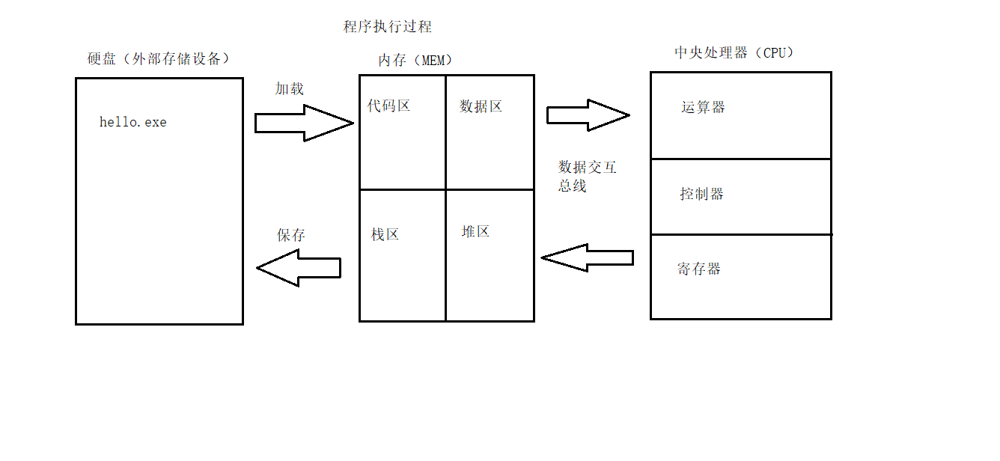
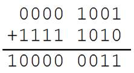

## 1. 1 C语言简介

C语言仅有32个关键字，9种控制语句，34种运算符：


## 1.2 C程序组成部分

```c
#include <stdio.h> // std是一个标准库 i=input o=output 标准输入输出库 .h 头文件

//单行注释
    /*
        多
        行
        注
        释
    */


// int 数据类型 整型 如果出现在函数中，表示函数的返回值
// main 程序的主函数 程序有且只有一个主函数 ()里面表示函数的参数
// 函数的参数可以是有很多个 用逗号隔开
// {} 函数体 代码体 程序体

int main(int argc, char const *argv[])
{
    // printf 是stdio.h中提供的函数 表示在标准输出设备上打印字符串
    // "" 字符串
    // ；一条语句的结束   
    // \n 转义字符 表示换行
    printf("hello world\n");
    
    // return 表示程序的结束
    // 0 表示程序的返回值 要和程序的返回类型相同
    return 0;
}
```

##### 1) include头文件包含

-  #include的意思是头文件包含，#include <stdio.h>代表包含stdio.h这个头文件
- 使用C语言库函数需要提前包含库函数对应的头文件，如这里使用了printf()函数，需要包含stdio.h头文件
- 可以通过man 3 printf查看printf所需的头文件

######  #include< > 与 #include ""的区别：

- < > 表示系统直接按系统指定的目录检索
- "" 表示系统先在 "" 指定的路径(没写路径代表当前路径)查找头文件，如果找不到，再按系统指定的目录检索

 

stdio.h是在操作系统的系统目录下：


 


##### 2) main函数

- 一个完整的C语言程序，是由一个、且只能有一个main()函数(又称主函数，必须有)和若干个其他函数结合而成（可选）。
- main函数是C语言程序的入口，程序是从main函数开始执行。

 

##### 3) {} 括号，程序体和代码块

- {}叫代码块，一个代码块内部可以有一条或者多条语句
- C语言每句可执行代码都是"**;**"分号结尾
- 所有的#开头的行，都代表预编译指令，预编译指令行结尾是没有分号的
- 所有的可执行语句必须是在代码块里面

 

##### 4) 注释

- //叫行注释，注释的内容编译器是忽略的，注释主要的作用是在代码中加一些说明和解释，这样有利于代码的阅读
- /**/叫块注释
- 块注释是C语言标准的注释方法
- 行注释是从C++语言借鉴过来的

 

##### 5) printf函数

- printf是C语言库函数，功能是向标准输出设备输出一个字符串
- printf(“hello world\n”); //\n的意思是回车换行

 

##### 6) return语句

- return代表函数执行完毕，返回return代表函数的终止

- 如果main定义的时候前面是int，那么return后面就需要写一个整数；如果main定义的时候前面是void，那么return后面什么也不需要写
- 在main函数中return 0代表程序执行成功，return -1代表程序执行失败
- int main()和void main()在C语言中是一样的，但C++只接受int main这种定义方式


## 1.3 编译

- 命令、选项和源文件之间使用空格分隔
- 一行命令中可以有零个、一个或多个选项
- 文件名可以包含文件的绝对路径，也可以使用相对路径
- 如果命令中不包含输出可执行文件的文件名，可执行文件的文件名会自动生成一个默认名，Linux平台为a.out，Windows平台为a.exe

```shell
gcc [-option1] ... <filename>
g++ [-option1] ... <filename>
```

##### gcc、g++编译常用选项

```bash
-o file		 指定生成的输出文件名为file
-E main.c -o main.i		只进行预处理
-S(大写)	   只进行预处理和编译
-c(小写)	   只进行预处理、编译和汇编
```


## 1.4 system 函数

```c
#include <stdlib.h>
int system(const char *command);
功能：在已经运行的程序中执行另外一个外部程序
参数：外部可执行程序名字
返回值：
	成功：0
	失败：任意数字
```

```c
#include <stdio.h>
#include <stdlib.h>

int main()
{
	//system("calc"); //windows平台
	system("ls"); //Linux平台, 需要头文件#include <stdlib.h>

	return 0;
}
```

注意：

- 如果程序带路径，需要使用`\\` 或 `/`


## 1.5 编译步骤

##### 一步编译（还是经过：预处理、编译、汇编、链接的过程）

```shell
gcc test.c -o test
```


##### C代码编译成可执行程序经过4步：

1）**预处理**：宏定义展开、头文件展开、条件编译等，同时将代码中的注释删除，这里*并不会检查语法*

```shell
gcc -E test.c -o test.i
```

2）**编译**：*检查语法*，将预处理后文件编译生成汇编文件

```shell
gcc -S test.i -o test.s
```

3）**汇编**：将汇编文件生成目标文件(二进制文件)

```shell
gcc -c test.s -o test.o
```

4）**链接**：C语言写的程序是需要依赖各种库的，所以编译之后还需要把库链接到最终的可执行程序中去

```shell
gcc test.o -o test
```


 

##### 常见代码问题：

1. 编辑时异常 - 编辑器会下划红线提示
2. 编译时异常 - 链接库时才找到
3. 运行时异常 - 代码没报错，但运行时得不到想要的结果

#### 1.5.2 查找程序所依赖的动态库

- Windows，使用软件`Depends.exe`
- Linux, 查看文档


## 1.6 程序运行过程




## 1.7  CPU内部结构与寄存器

#### 1.7.1    64位和32位系统区别

- 寄存器是CPU内部最基本的存储单元
- CPU对外是通过总线(地址、控制、数据)来和外部设备交互的，总线的宽度是8位，同时CPU的寄存器也是8位，那么这个CPU就叫8位CPU
- 如果总线是32位，寄存器也是32位的，那么这个CPU就是32位CPU
- 有一种CPU内部的寄存器是32位的，但总线是16位，准32位CPU
- 所有的64位CPU兼容32位的指令，32位要兼容16位的指令，所以在64位的CPU上是可以识别32位的指令
- 在64位的CPU构架上运行了64位的软件操作系统，那么这个系统是64位
- 在64位的CPU构架上，运行了32位的软件操作系统，那么这个系统就是32位
- 64位的软件不能运行在32位的CPU之上

#### 1.7.2     寄存器名字

| 8 位 | 16位 | 32位 | 64位 |
| ---- | ---- | ---- | ---- |
| A    | AX   | EAX  | RAX  |
| B    | BX   | EBX  | RBX  |
| C    | CX   | ECX  | RCX  |
| D    | DX   | EDX  | RDX  |


#### 1.7.3    寄存器、缓存、内存三者关系

按与CPU远近来分，离得最近的是寄存器，然后缓存(CPU缓存)，最后内存。

CPU计算时，先预先把要用的数据从硬盘读到内存，然后再把即将要用的数据读到寄存器。于是 `CPU <---> 寄存器 <---> 内存`，这就是它们之间的信息交换。

那为什么有缓存呢？因为如果经常操作内存中的同一址地的数据，就会影响速度。于是就在寄存器与内存之间设置一个缓存。

因为从缓存提取的速度远高于内存。当然缓存的价格肯定远远高于内存，不然的话，机器里就没有内存的存在。

由此可以看出，从远近来看：`CPU <---> 寄存器 <---> 缓存 <---> 内存`。


## 1.8 汇编语言

#### 1.8.1    VS中C语言嵌套汇编代码

用`__asm`告诉C程序，这里面是汇编语言

```c
#include <stdio.h>

int main()
{
	//定义整型变量a, b, c
	int a;
	int b;
	int c;

	__asm
	{
		mov a, 3	//3的值放在a对应内存的位置
		mov b, 4	//4的值放在b对应内存的位置
		mov eax, a	//把a内存的值放在eax寄存器
		add eax, b	//eax和b相加，结果放在eax
		mov c, eax	//eax的值放在c中
	}
	
	printf("%d\n",  c);//把c的值输出

	return 0;//成功完成
}

```

（vscode中不能这么写）

#### 1.8.2    VS反汇编

```c
#include <stdio.h>

int main()
{
	//定义整型变量a, b, c
	int a;
	int b;
	int c;

	a = 3;
	b = 4;
	c = a + b;
	
	printf("%d\n",  c);//把c的值输出

	return 0;//成功完成
}
```

1. 设置断点F9


2. 选择反汇编按钮


3. 根据汇编代码分析程序


## 2.1 常量和变量

#### 2.1 关键字

C的关键字总共有32个：

- 数据类型关键字（12个）
  - char, short, int, long, float, double, unsigned, signed
  - struct, union, enum, void, void*(万能数据类型)
- 控制语句关键字（12个）
  - if, else, switch, case, default
  - for, do, while, break, continue, goto, return
- 存储类关键字（5个）
  - auto, extern, register, static, const
- 其他关键字（3个）
  - sizeof, typedef, volatile

#### 2.2 数据类型

数据类型的作用：编译器预算对象（变量）分配的内存空间大小。


#### 2.3 常量

常量：

- 在程序运行过程中，其值不能被改变的量
- 常量一般出现在表达式或赋值语句中

定义格式：

- `const float pi = 3.141592;`
- `#define PI 3.141592`

| 整型常量   | 100，200，-100，0      |
| ---------- | ---------------------- |
| 实型常量   | 3.14  ， 0.125，-3.123 |
| 字符型常量 | ‘a’,‘b’,‘1’,‘\n’       |
| 字符串常量 | “a”,“ab”，“12356”      |


#### 2.4 变量

变量

- 在程序运行过程中，其值可以改变
- 变量在使用前必须先定义，定义变量前必须有相应的数据类型

变量特点：

- 变量在编译时为其分配相应的内存空间
- 可以通过其名字和地址访问相应内存

 


```c
#include <stdio.h> 

// 宏定义常量
#define PI 3.141592

int main(int argc, char const *argv[])
{

    // 常量PI
    // const 数据类型 常量名 = 值 (这种写法在c语言中是不安全的，但在c++中是安全的)
    const float pi = 3.141592;
    // 在定义局部变量时可在数据类型前加修饰auto，也可以不加（一般不加）
    auto float r = 3.4;

    // 周长
    float l = 2*pi*r;
    // 面积
    float a = pi*r*r;

    // 占位符 %f 表示输出一个浮点型 float 默认保留6位小数, 会四舍五入
    printf("%f\n", l);
    printf("%f\n", a);

    printf("%.2f\n", l);
    printf("%.2f\n", a);
    return 0;
}
```


#### 标识符命名规则：

- 标识符不能是关键字
- 标识符只能由字母、数字、下划线组成
- 第一个字符必须为字母或下划线
- 标识符中字母区分大小写

#### 声明和定义区别

- 声明变量不需要建立存储空间，如：extern int a;
- 定义变量需要建立存储空间，如：int b;

```c
#include <stdio.h>

int main()
{
	//extern 关键字只做声明，不能做任何定义，后面还会学习，这里先了解
	//声明一个变量a，a在这里没有建立存储空间
	extern int a;
	a = 10;	//err, 没有空间，就不可以赋值

	int b = 10;	//定义一个变量b，b的类型为int，b赋值为10

	return 0;
}
```

从广义的角度来讲声明中包含着定义，即定义是声明的一个特例，所以并非所有的声明都是定义：

- int b 它既是声明，同时又是定义
- 对于 extern b来讲它只是声明不是定义

一般的情况下，把建立存储空间的声明称之为“定义”，而把不需要建立存储空间的声明称之为“声明”。


## 2.2 整型 int

#### 2.2.1 整型变量的定义和输出

| **打印格式** | **含义**                            |
| ------------ | ----------------------------------- |
| %d           | 输出一个有符号的10进制int类型       |
| %o(字母o)    | 输出8进制的int类型                  |
| %x           | 输出16进制的int类型，字母以小写输出 |
| %X           | 输出16进制的int类型，字母以大写输出 |
| %u           | 输出一个10进制的无符号数            |

```c
#include <stdio.h>

int main()
{
	int a = 123;	//定义变量a，以10进制方式赋值为123
	int b = 0567;	//定义变量b，以8进制方式赋值为0567
	int c = 0xabc;	//定义变量c，以16进制方式赋值为0xabc

	printf("a = %d\n", a);
	printf("8进制：b = %o\n", b);
	printf("10进制：b = %d\n", b);
	printf("16进制：c = %x\n", c);
	printf("16进制：c = %X\n", c);
	printf("10进制：c = %d\n", c);

	unsigned int d = 0xffffffff; //定义无符号int变量d，以16进制方式赋值
	printf("有符号方式打印：d = %d\n", d);
	printf("无符号方式打印：d = %u\n", d);
	return 0;
}
```

#### 2.2.2 整型变量的输入

```c
#include <stdio.h>

int main()
{
	int a;
	printf("请输入a的值：");

    // &运算符 表示取地址运算符
	//不要加“\n”
	scanf("%d", &a); 

	printf("a = %d\n", a); //打印a的值

	return 0;
}
```

注意：某些编译器会提示`scanf()`不安全，此时需要在include上方加`#define _CRT_SECURE_NO_WARNINGS`


#### 2.2.3 short、int、long、long long

| **数据类型**        | **占用空间**                                    |
| ------------------- | ----------------------------------------------- |
| short(短整型)       | 2字节                                           |
| int(整型)           | 4字节                                           |
| long(长整形)        | Windows为4字节，Linux为4字节(32位)，8字节(64位) |
| long long(长长整形) | 8字节                                           |

注意：

- 需要注意的是，整型数据在内存中占的字节数与所选择的操作系统有关。虽然 C 语言标准中没有明确规定整型数据的长度，但 long 类型整数的长度不能短于 int 类型， short 类型整数的长度不能长于 int 类型。
- 当一个小的数据类型赋值给一个大的数据类型，不会出错，因为编译器会自动转化。但当一个大的类型赋值给一个小的数据类型，那么就可能丢失高位。

| **整型常量** | **所需类型**               |
| ------------ | -------------------------- |
| 10           | 代表int类型                |
| 10l, 10L     | 代表long类型               |
| 10ll, 10LL   | 代表long long类型          |
| 10u, 10U     | 代表unsigned int类型       |
| 10ul, 10UL   | 代表unsigned long类型      |
| 10ull, 10ULL | 代表unsigned long long类型 |

| **打印格式** | **含义**                   |
| ------------ | -------------------------- |
| %hd          | 输出short类型              |
| %d           | 输出int类型                |
| %ld          | 输出long类型               |
| %lld         | 输出long long类型          |
| %hu          | 输出unsigned short类型     |
| %u           | 输出unsigned int类型       |
| %lu          | 输出unsigned long类型      |
| %llu         | 输出unsigned long long类型 |

```c
#include <stdio.h>

int main()
{
	short a = 10;
	int b = 10;
	long c = 10l; //或者10L
	long long d = 10ll; //或者10LL

	printf("sizeof(a) = %u\n", sizeof(a));
	printf("sizeof(b) = %u\n", sizeof(b));
	printf("sizeof(c) = %u\n", sizeof(c));
	printf("sizeof(c) = %u\n", sizeof(d));

	printf("short a = %hd\n", a);
	printf("int b = %d\n", b);
	printf("long c = %ld\n", c);
	printf("long long d = %lld\n", d);

	unsigned short a2 = 20u;
	unsigned int b2 = 20u;
	unsigned long c2= 20ul; 
	unsigned long long d2 = 20ull; 

	printf("unsigned short a = %hu\n", a2);
	printf("unsigned int b = %u\n", b2);
	printf("unsigned long c = %lu\n", c2);
	printf("unsigned long long d = %llu\n", d2);

	return 0;
}
```

#### 2.2.4 有符号数和无符号数区别

##### 有符号数

有符号数是最高位为符号位，0代表正数，1代表负数。

```c
#include <stdio.h>

int main()
{
	signed int a = -1089474374; //定义有符号整型变量a
	printf("%X\n", a); //结果为 BF0FF0BA
    
    // signed 有符号 关键字可省略
    int b = 10;
    int c = -10

	//B       F      0        F       F     0        B	      A
	//1011 1111 0000 1111 1111 0000 1011 1010

	return 0;
}
```

##### 无符号数

无符号数最高位不是符号位，而就是数的一部分，无符号数不可能是负数。


```c
#include <stdio.h>

int main()
{
	unsigned int a = 3236958022; //定义无符号整型变量a
	printf("%X\n", a); //结果为 C0F00F46

    // unsigned 无符号 
   	// %u 占位符 表示输出一个无符号的十进制整型数据
    unsigned int a = -10; 
    printf("%u\n", a); // 
    printf("%d\n", a); // 10
	return 0;
}
```

当我们写程序要处理一个不可能出现负值的时候，一般用无符号数，这样可以增大数的表达最大值。

##### 有符号和无符号整型取值范围

| **数据类型**   | **占用空间** | **取值范围**                              |
| -------------- | ------------ | ----------------------------------------- |
| short          | 2字节        | -32768 到 32767 (-215  ~ 215-1)           |
| int            | 4字节        | -2147483648 到  2147483647 (-231 ~ 231-1) |
| long           | 4字节        | -2147483648 到  2147483647 (-231 ~ 231-1) |
| unsigned short | 2字节        | 0 到 65535 (0 ~ 216-1)                    |
| unsigned int   | 4字节        | 0 到 4294967295 (0  ~ 232-1)              |
| unsigned long  | 4字节        | 0 到 4294967295 (0  ~ 232-1)              |

## 2.3 sizeof关键字

- sizeof不是函数，所以不需要包含任何头文件，它的功能是计算一个数据类型的大小，单位为字节
- sizeof的返回值为size_t
- size_t类型在32位操作系统下是unsigned int，是一个无符号的整数

语法格式：

- `sizeof(数据类型)`
- `sizeof(变量名)`
- `sizeof 变量名`

```c
#include <stdio.h>

int main()
{
	int a;
	int b = sizeof(a);//sizeof得到指定值占用内存的大小，单位：字节
	printf("b = %d\n", b);

	size_t c = sizeof(a);
	printf("c = %u\n", c);//用无符号数的方式输出c的值

	return 0;
}
```


## 2.4字符型：char

#### 2.4.1 字符变量的定义和输出

字符型变量用于存储一个单一字符，在 C 语言中用 char 表示，其中每个字符变量都会占用 1 个字节。在给字符型变量赋值时，需要用一对英文半角格式的单引号(' ')把字符括起来。

字符变量实际上并不是把该字符本身放到变量的内存单元中去，而是将该字符对应的 ASCII 编码放到变量的存储单元中。char的本质就是一个1字节大小的整型。

```c
#include <stdio.h>

int main()
{
	char ch = 'a';
	printf("sizeof(ch) = %u\n", sizeof(ch));

	printf("ch[%%c] = %c\n", ch); //打印字符
	printf("ch[%%d] = %d\n", ch); //打印‘a’ ASCII的值

	char A = 'A';
	char a = 'a';
	printf("a = %d\n", a);		//97
	printf("A = %d\n", A);	//65

	printf("A = %c\n", 'a' - 32); //小写a转大写A
	printf("a = %c\n", 'A' + 32); //大写A转小写a

	ch = ' ';
	printf("空字符：%d\n", ch); //空字符ASCII的值为32
	printf("A = %c\n", 'a' - ' '); //小写a转大写A
	printf("a = %c\n", 'A' + ' '); //大写A转小写a

	return 0;
}
```


#### 2.4.2 字符变量的输入

```c
#include <stdio.h>

int main()
{
	char ch;
	printf("请输入ch的值：");

	//不要加“\n”
	scanf("%c", &ch);
	printf("ch = %c\n", ch); //打印ch的字符

	return 0;
}
```

#### 2.4.3 ASCII对照表

| **ASCII****值** | **控制字符** | **ASCII****值** | **字符** | **ASCII****值** | **字符** | **ASCII****值** | **字符** |
| --------------- | ------------ | --------------- | -------- | --------------- | -------- | --------------- | -------- |
| 0               | NUT          | 32              | (space)  | 64              | @        | 96              | 、       |
| 1               | SOH          | 33              | !        | 65              | A        | 97              | a        |
| 2               | STX          | 34              | "        | 66              | B        | 98              | b        |
| 3               | ETX          | 35              | #        | 67              | C        | 99              | c        |
| 4               | EOT          | 36              | $        | 68              | D        | 100             | d        |
| 5               | ENQ          | 37              | %        | 69              | E        | 101             | e        |
| 6               | ACK          | 38              | &        | 70              | F        | 102             | f        |
| 7               | BEL          | 39              | ,        | 71              | G        | 103             | g        |
| 8               | BS           | 40              | (        | 72              | H        | 104             | h        |
| 9               | HT           | 41              | )        | 73              | I        | 105             | i        |
| 10              | LF           | 42              | *        | 74              | J        | 106             | j        |
| 11              | VT           | 43              | +        | 75              | K        | 107             | k        |
| 12              | FF           | 44              | ,        | 76              | L        | 108             | l        |
| 13              | CR           | 45              | -        | 77              | M        | 109             | m        |
| 14              | SO           | 46              | .        | 78              | N        | 110             | n        |
| 15              | SI           | 47              | /        | 79              | O        | 111             | o        |
| 16              | DLE          | 48              | 0        | 80              | P        | 112             | p        |
| 17              | DCI          | 49              | 1        | 81              | Q        | 113             | q        |
| 18              | DC2          | 50              | 2        | 82              | R        | 114             | r        |
| 19              | DC3          | 51              | 3        | 83              | S        | 115             | s        |
| 20              | DC4          | 52              | 4        | 84              | T        | 116             | t        |
| 21              | NAK          | 53              | 5        | 85              | U        | 117             | u        |
| 22              | SYN          | 54              | 6        | 86              | V        | 118             | v        |
| 23              | TB           | 55              | 7        | 87              | W        | 119             | w        |
| 24              | CAN          | 56              | 8        | 88              | X        | 120             | x        |
| 25              | EM           | 57              | 9        | 89              | Y        | 121             | y        |
| 26              | SUB          | 58              | :        | 90              | Z        | 122             | z        |
| 27              | ESC          | 59              | ;        | 91              | [        | 123             | {        |
| 28              | FS           | 60              | <        | 92              | /        | 124             | \|       |
| 29              | GS           | 61              | =        | 93              | ]        | 125             | }        |
| 30              | RS           | 62              | >        | 94              | ^        | 126             | `        |
| 31              | US           | 63              | ?        | 95              | _        | 127             | DEL      |

ASCII 码大致由以下两部分组成：

- ASCII 非打印控制字符： ASCII 表上的数字 0-31 分配给了控制字符，用于控制像打印机等一些外围设备。
- ASCII 打印字符：数字 32-126 分配给了能在键盘上找到的字符，当查看或打印文档时就会出现。数字 127 代表 Del 命令。

```c
// 小写字母转大写字母
#include <stdio.h> 

int main(int argc, char const *argv[])
{
    char ch;
    scanf("%c", &ch);
    printf("%c\n", ch-32);
    return 0;
}
```


#### 2.4.4 转义字符

| **转义字符** | **含义**                            | **ASCII****码值（十进制）** |
| ------------ | ----------------------------------- | --------------------------- |
| ==\a==       | 警报                                | 007                         |
| ==\b==       | 退格(BS) ，将当前位置移到前一列     | 008                         |
| ==\f==       | 换页(FF)，将当前位置移到下页开头    | 012                         |
| ==\n==       | 换行(LF) ，将当前位置移到下一行开头 | 010                         |
| ==\r==       | 回车(CR) ，将当前位置移到本行开头   | 013                         |
| ==\t==       | 水平制表(HT)  （跳到下一个TAB位置） | 009                         |
| ==\v==       | 垂直制表(VT)                        | 011                         |
| `\\`         | 代表一个反斜线字符"\"               | 092                         |
| `  \'  `     | 代表一个单引号（撇号）字符          | 039                         |
| `  \"  `     | 代表一个双引号字符                  | 034                         |
| `  \?  `     | 代表一个问号                        | 063                         |
| ` \0  `      | 数字0                               | 000                         |
| ` \ddd`      | 8进制转义字符，d范围0~7             | 3位8进制                    |
| `\xhh  `     | 16进制转义字符，h范围0~9，a~f，A~F  | 3位16进制                   |


## 2.5实型(浮点型)：float、double

实型变量也可以称为浮点型变量，浮点型变量是用来存储小数数值的。在C语言中， 浮点型变量分为两种： 单精度浮点数(float)、 双精度浮点数(double)， 但是double型变量所表示的浮点数比 float 型变量更精确。

由于浮点型变量是由有限的存储单元组成的，因此只能提供有限的有效数字。在有效位以外的数字将被舍去，这样可能会产生一些误差。

不以f结尾的常量是double类型，以f结尾的常量(如3.14f)是float类型。

```c
#include <stdio.h>

int main()
{
	//传统方式赋值
	float a = 3.14f; //或3.14F
	double b = 3.14;

	printf("a = %f\n", a);
	printf("b = %lf\n", b);

	//科学法赋值
	a = 3.2e3f; //3.2*1000 = 3200，e可以写E
	printf("a1 = %f\n", a);

	a = 100e-3f; //100*0.001 = 0.1
	printf("a2 = %f\n", a);

	a = 3.1415926f;
	printf("a3 = %f\n", a); //结果为3.141593

	return 0;
}
```


%p - 占位符，表示输出一个变量对应的内存地址编号（无符号十六进制整数）


#### 小数转二进制

十进制的小数转换成二进制：小数部分和2相乘，取整数，不足1取0，每次相乘都是小数部分，顺序看取整后的数就是转化后的结果。


## 2.6 计算机内存数值存储方式

#### 2.6.1 原码

一个数的原码(原始的二进制码)有如下特点：

- 最高位做为符号位，0表示正,为1表示负
- 其它数值部分就是数值本身绝对值的二进制数
- 负数的原码是在其绝对值的基础上，最高位变为1

下面数值以1字节的大小描述：

| **十进制数** | **原码**  |
| ------------ | --------- |
| +15          | 0000 1111 |
| -15          | 1000 1111 |
| +0           | 0000 0000 |
| -0           | 1000 0000 |

原码表示法简单易懂，与带符号数本身转换方便，只要符号还原即可，但当两个正数相减或不同符号数相加时，必须比较两个数哪个绝对值大，才能决定谁减谁，才能确定结果是正还是负，所以原码不便于加减运算。

#### 2.6.2 反码

- 对于正数，反码与原码相同
- 对于负数，符号位不变，其它部分取反(1变0,0变1)

| **十进制数** | **反码**  |
| ------------ | --------- |
| +15          | 0000 1111 |
| -15          | 1111 0000 |
| +0           | 0000 0000 |
| -0           | 1111 1111 |

反码运算也不方便，通常用来作为求补码的中间过渡。


#### 2.6.3 补码

**在计算机系统中，数值一律用补码来存储。**

补码特点：

- 对于正数，原码、反码、补码相同
- 对于负数，其补码为它的反码加1
- 补码符号位不动，其他位求反，最后整个数加1，得到原码

| **十进制数** | **补码**  |
| ------------ | --------- |
| +15          | 0000 1111 |
| -15          | 1111 0001 |
| +0           | 0000 0000 |
| -0           | 0000 0000 |


```c
#include <stdio.h>

int main()
{
	int  a = -15;

	printf("%x\n", a);
	//结果为 fffffff1
	//fffffff1对应的二进制：1111 1111 1111 1111 1111 1111 1111 0001
	//符号位不变，其它取反：1000 0000 0000 0000 0000 0000 0000 1110
	//上面加1：1000 0000 0000 0000 0000 0000 0000 1111  最高位1代表负数，就是-15

	return 0;
}

```


## 2.6.4 补码的意义

示例1：用8位二进制数分别表示+0和-0

| **十进制数** | **原码**  |
| ------------ | --------- |
| +0           | 0000 0000 |
| -0           | 1000 0000 |

| **十进制数** | **反码**   |
| ------------ | ---------- |
| +0           | 0000 0000  |
| -0           | 01111 1111 |

不管以原码方式存储，还是以反码方式存储，0也有两种表示形式。为什么同样一个0有两种不同的表示方法呢？

但是如果以补码方式存储，补码统一了零的编码：

| **十进制数** | **补码**                                              |
| ------------ | ----------------------------------------------------- |
| +0           | 0000 0000                                             |
| -0           | 10000 0000由于只用8位描述，最高位1丢弃，变为0000 0000 |


示例2：计算9-6的结果

以原码方式相加：

| **十进制数** | **原码**  |
| ------------ | --------- |
| 9            | 0000 1001 |
| -6           | 1000 0110 |


结果为-15，不正确。

以补码方式相加：

| **十进制数** | **补码**  |
| ------------ | --------- |
| 9            | 0000 1001 |
| -6           | 1111 1010 |

 



 

最高位的1溢出,剩余8位二进制表示的是3，正确。


**在计算机系统中，数值一律用补码来存储**，主要原因是：

- 统一了零的编码
- 将符号位和其它位统一处理
- 将减法运算转变为加法运算
- 两个用补码表示的数相加时，如果最高位(符号位)有进位，则进位被舍弃

####  2.6.5 数值溢出

当超过一个数据类型能够存放最大的范围时，数值会溢出。

有符号位最高位溢出的区别：符号位溢出会导致数的正负发生改变，但最高位的溢出会导致最高位丢失。

| **数据类型**  | **占用空间** | **取值范围**            |
| ------------- | ------------ | ----------------------- |
| char          | 1字节        | -128到 127(-27  ~ 27-1) |
| unsigned char | 1字节        | 0 到 255(0 ~ 28-1)      |

```c
#include <stdio.h>

int main()
{
	char ch;

	//符号位溢出会导致数的正负发生改变
	ch = 0x7f + 2; //127+2
	printf("%d\n", ch);
	//	0111 1111
	//+2后 1000 0001，这是负数补码，其原码为 1111 1111，结果为-127

	//最高位的溢出会导致最高位丢失
	unsigned char ch2;
	ch2 = 0xff + 1; //255+1
	printf("%u\n", ch2);
	//	  1111 1111
	//+1后 10000 0000， char只有8位最高位的溢出，结果为0000 0000，十进制为0

	ch2 = 0xff + 2; //255+1
	printf("%u\n", ch2);
	//	  1111 1111
	//+1后 10000 0001， char只有8位最高位的溢出，结果为0000 0001，十进制为1

	return 0;
}
```


## 2.7 类型限定符

| 限定符   | **含义**                                                     |
| -------- | ------------------------------------------------------------ |
| extern   | 声明一个变量，extern声明的变量没有建立存储空间。  extern int a;//变量在定义的时候创建存储空间 |
| const    | 定义一个常量，常量的值不能修改。  const int a = 10;          |
| Volatile | 防止编译器优化代码                                           |
| register | 定义寄存器变量，提高效率。register是建议型的指令，而不是命令型的指令，如果CPU有空闲寄存器，那么register就生效，如果没有空闲寄存器，那么register无效。 |


## 2.8 字符串格式化输出和输入

#### 2.8.1 字符串常量

- 字符串是内存中一段连续的char空间，以'\0'(数字0)结尾。
- 字符串常量是由双引号括起来的字符序列，如“china”、“C program”，“$12.5”等都是合法的字符串常量。

字符串常量与字符常量的不同：


每个字符串的结尾，编译器会自动的添加一个结束标志位'\0'，即 "a" 包含两个字符'a'和’\0’。


#### 2.8.2 printf函数和putchar函数

printf是输出一个字符串，putchar输出一个char。

printf格式字符：

| **打印格式** | **对应数据类型** | **含义**                                                     |
| ------------ | ---------------- | ------------------------------------------------------------ |
| %d           | int              | 接受整数值并将它表示为有符号的十进制整数                     |
| %hd          | short int        | 短整数                                                       |
| %hu          | unsigned short   | 无符号短整数                                                 |
| %o           | unsigned int     | 无符号8进制整数                                              |
| %u           | unsigned int     | 无符号10进制整数                                             |
| %x,%X        | unsigned int     | 无符号16进制整数，x对应的是abcdef，X对应的是ABCDEF           |
| %f           | float            | 单精度浮点数                                                 |
| %lf          | double           | 双精度浮点数                                                 |
| %e,%E        | double           | 科学计数法表示的数，此处"e"的大小写代表在输出时用的"e"的大小写 |
| %c           | char             | 字符型。可以把输入的数字按照ASCII码相应转换为对应的字符      |
| %s           | char *           | 字符串。输出字符串中的字符直至字符串中的空字符（字符串以'\0‘结尾，这个'\0'即空字符） |
| %p           | void *           | 以16进制形式输出指针                                         |
| %%           | %                | 输出一个百分号                                               |


printf附加格式：

| **字符**          | **含义**                                                     |
| ----------------- | ------------------------------------------------------------ |
| l(字母l)          | 附加在d,u,x,o前面，表示长整数                                |
| -                 | 左对齐                                                       |
| m(代表一个整数)   | 数据最小宽度                                                 |
| 0(数字0)          | 将输出的前面补上0直到占满指定列宽为止不可以搭配使用-         |
| m.n(代表一个整数) | m指域宽，即对应的输出项在输出设备上所占的字符数。n指精度，用于说明输出的实型数的小数位数。对数值型的来说，未指定n时，隐含的精度为n=6位。 |

```c
#include <stdio.h>
int main()
{
	int a = 100;
	printf("a = %d\n", a);//格式化输出一个字符串
	printf("%p\n", &a);//输出变量a在内存中的地址编号
	printf("%%d\n");

	char c = 'a';
	putchar(c);//putchar只有一个参数，就是要输出的char
	long a2 = 100;
	printf("%ld, %lx, %lo\n", a2, a2, a2);

	long long a3 = 1000;
	printf("%lld, %llx, %llo\n", a3, a3, a3);

	int abc = 10;
	printf("abc = '%6d'\n", abc);
	printf("abc = '%-6d'\n", abc);
	printf("abc = '%06d'\n", abc);
	printf("abc = '%-06d'\n", abc);

	double d = 12.3;
	printf("d = \' %-10.3lf \'\n", d);

	return 0;
}
```


#### 2.9.3 scanf函数与getchar函数

- getchar是从标准输入设备读取一个char。
- scanf通过%转义的方式可以得到用户通过标准输入设备输入的数据。

```c
#include <stdio.h>

int main()
{
	char ch1;
	char ch2;
	char ch3;
	int a;
	int b;

	printf("请输入ch1的字符：");
	ch1 = getchar();
	printf("ch1 = %c\n", ch1);

	getchar(); //测试此处getchar()的作用

	printf("请输入ch2的字符：");
	ch2 = getchar();
	printf("\'ch2 = %ctest\'\n", ch2);

	getchar(); //测试此处getchar()的作用
	printf("请输入ch3的字符：");
	scanf("%c", &ch3);//这里第二个参数一定是变量的地址，而不是变量名
	printf("ch3 = %c\n", ch3);

	printf("请输入a的值：");
	scanf("%d", &a);
	printf("a = %d\n", a);

	printf("请输入b的值：");
	scanf("%d", &b);
	printf("b = %d\n", b);

	return 0;
}
```

