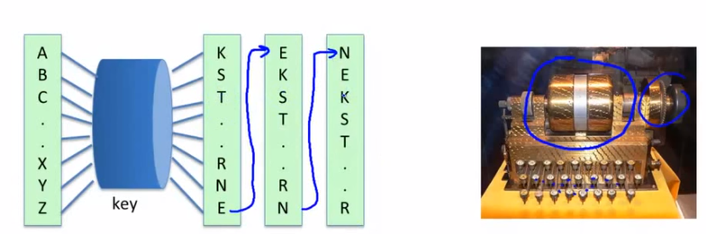
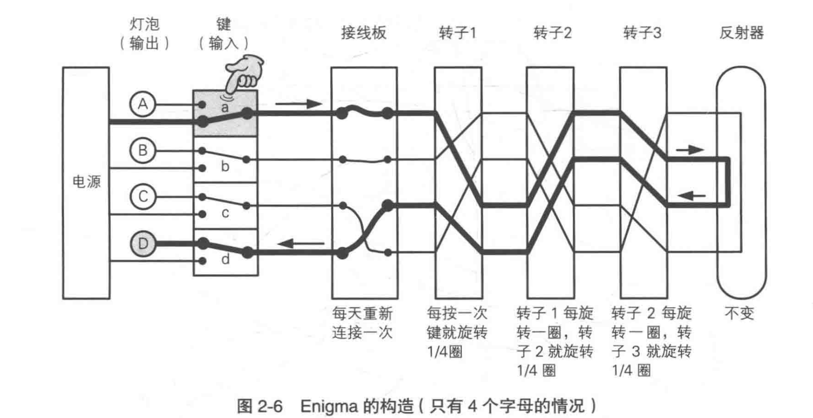
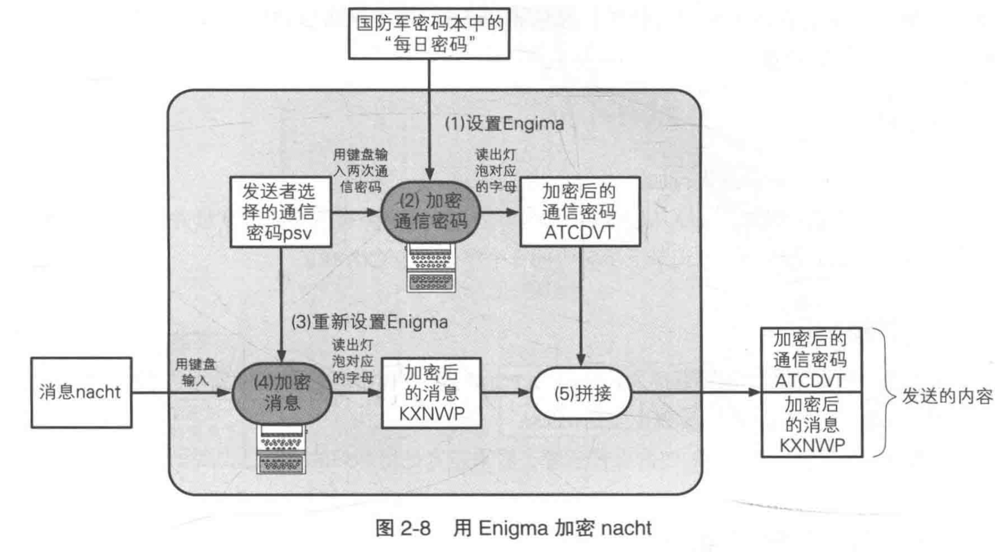

# 近代密码学 - Rotor Machine 转轮密码机

(1870-1943)

### Early example: the Hebern machine (single rotor)

按一次，rotor会转一次，如果按了ccc，则输出为tsk

破解：用频度分析法，仍可破解

### Most famous: the Enigma (3-5 rotors)

恩尼格玛密码机 - 核心使用的也是 替换法 和 移位法

被 人工智能之父 图灵 破解

rotor 可以向两侧的任意方向转动

