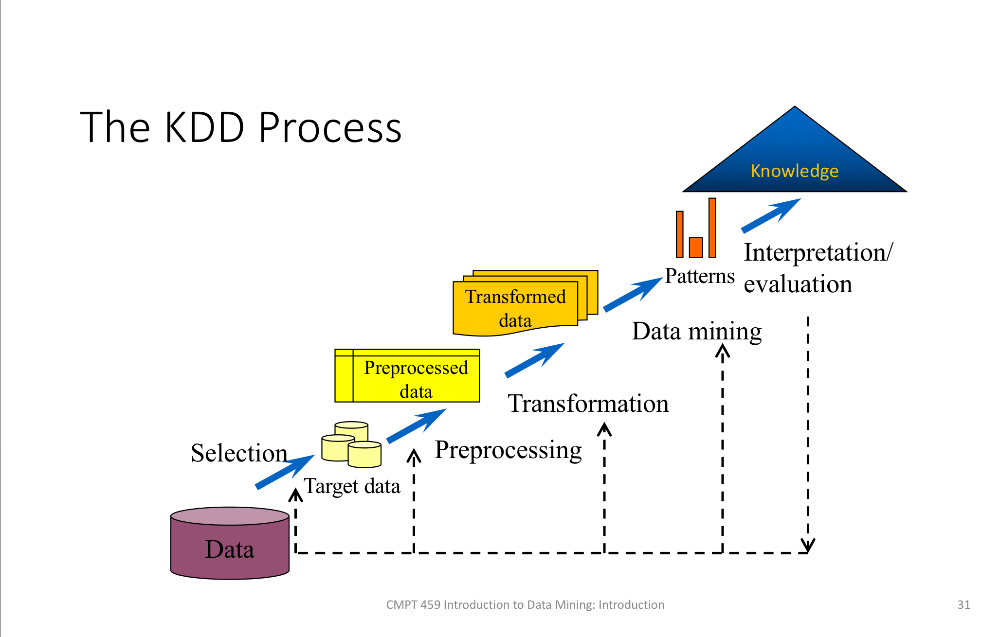
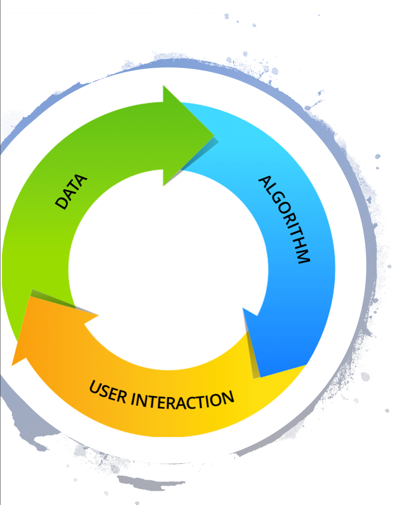
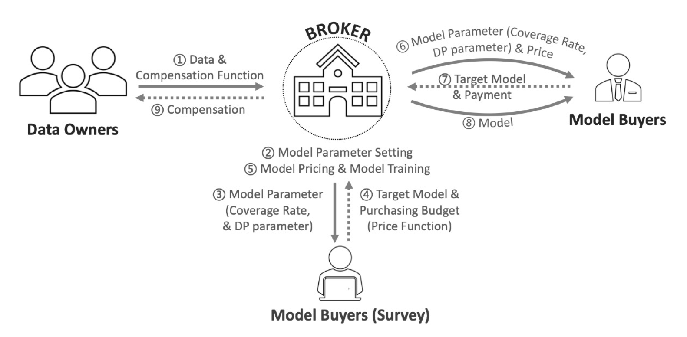

# Introduction

### Why are patterns important?

- summarization of data - hard to understand every detailed piece of data.
- basic models of data
- finding laws and rules behind data
- building blocks of advanced data mining and analytics tasks

### Prediction/Classification: Turning data into Actions

- predicting future based on history
- classifying unseen cases based on observed cases
- accurate prediction/classification matters, but what is accuracy?
  - precision versus recall

### Different Types of Data

- Transaction data
- Sequence data
- Temporal data
- Networks
- Geographical data

### What is data science about?

- data
- extraction of knowledge from data
- continuation of data mining and knowledge discovery from data (KDD)

> key skills for data scientists are not the abilities to build and use deep-learning infrastructures. Instead they are the abilities to learn on the fly and to communicate well in order to answer business questions, explaining complex results to nontechnical stakeholders. 

### What is data?

- Values of qualitative or quantitative variables belonging to a set of items. 
- Typically the results of measurements
- represented in a structure, e.g. tabular, tree or graph structure
- as an abstract concept can be viewed as the lowest level of abstraction from which information and then knowledge are derived. 

### What is information?

- “knowledge communicated or received concerning a particular fact or circumstance”
- conceptually, information is the message (utterance or expression) being conveyed 
- cannot be predicted
- can resolve uncertainty

### What is knowledge?

- Familiarity with someone or something, which can include facts, information, descriptions, or skills acquired through experience or education
- (实践) **Implicit knowledge**: practical skill or expertise
- (理论) **Explicit knowledge**: theoretical understanding of a subject

### Data Systems

- A **data system** answers queries based on data acquired in the past
- **Base data** - the rawest data not derived from anywhere else
- **Knowledge** - information derived from the base data

### Queries

- A precise request for information
- Subjects in databases and information retrieval
  - **Databases**: structured queries on structured data (e.g. relational data)
  - **Information retrieval**: unstructured queries on unstructured data (e.g., text, image)
  - The boundary between the two is less and less strict and more and more fuzzy.
- Important assumptions
  - Information needs
  - Query languages

### Data-driven exploration 数据驱动的探索

- What should be the next strategy of a company?
  - A lot of data: sales, human resource, production, tax, service cost, …
- The question cannot be translated into a precise request for information (i.e., a query)
- Developing familiarity (knowledge) and actionable items (decisions) by interactively analyzing data

### Data-driven thinking

- Starting with some simple queries
- New queries are raised by consuming the results of previous queries
- No ultimate query in design!
  - But many queries can be answered using DB/IR techniques. 

### The art of data-driven thinking 

- The way of generating queries remains an art!
  - Different people may derive different results using the same data
  - If you torture the data long enough, it will confess
- Often, more data may be needed - datafication

### Queries for Data-driven thinking

- Probe queries - finding information about specific individuals
- aggregation - finding information about groups
- pattern finding - finding commonality in population
- association and correlation - finding connections among individuals and groups
- causality analysis - finding causes and consequences

### What is Data Mining?

- Broader sense: the art of data-driven thinking
- Technical sense: the non-trivial process of identifying valid, novel, potentially useful, and ultimately understandable patterns in data.
- Methods and tools of answering various types of queries in the data mining process in the broader sense. 

### Machine Learning

> A computer program is said to learn from experience E with respect to some class of tasks T and performance measure P, if its performance at tasks in T, as measured by P, improves with experience E.

### Data Mining vs. Machine Learning

- Machine learning focuses on *prediction*, based on known properties learned from the training data. 
- Data mining focuses on the discovery of (previously) unknown properties on the data. 

### The KDD Process

### Data Mining Research and Development

- New problem identification
- Data collection and transformation
- Algorithm design and implementation 
- Evaluation
  - Effectiveness evaluation
  - Efficiency & scalability evaluation
- Development and business solution

前四点不足以使Data Mining end-to-end, 第五点做到了。

### Data Driven or Algorithm Driven?

- Algorithm + Data Structures = Programs
- Algorithm / process first or data first?

### Fairness in Data Science

- Bias in data may lead to bias in derivatives from data
- Algorithms may contain biases
- Ensuring fairness in data science
  - Cooperative acts: evaluating data science products by human devil’s advocate
  - Negotiation between utility and humanity
  - Accountability and responsibility

### Diversity 

- 2 types of diversity 
  - **inessential diversity** (surface level, observable): religion, race, ethnicity, national origin, demographics, culture, age, …
  - **Essential diversity** (deep level, less observable): domain knowledge, competence, skills, …
- Understanding diversity
- Tracking and recording diversity
- Transparency in diversity

### Data Assertization 数据资产化

- Digitalization and datatization
  - **Datatization**: an organization’s capability and processes to change its value proposition using data analytics
  - Data evaluation, pricing and assertization
  - Data supply chain
  - Data exchange and markets

