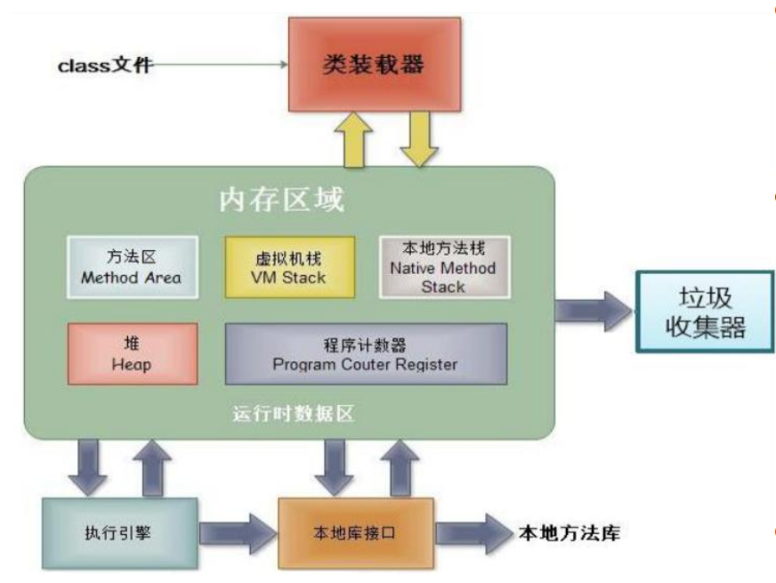

[TOC]


# 对象

- Java面向对象学习的三条主线
  - Java类及类成员：属性、方法、构造器; 代码块、内部类
  - 面向对象的三大特征：封装性、继承性、多态性、（抽象性）
  - 其他关键字：`this`, `super`, `static`, `final`, `abstract`, `interface`, `package`, `import` 

### 面向过程 & 面向对象

##### 面向过程 （POP - Procedure Oriented Programming）

强调功能行为，以函数为最小单位，考虑怎么做。

##### 面向对象（OOP - Object Oriented Programming）

将功能封装进对象，强调具备了功能的对象，以类/对象为最小单位，考虑谁来做。

- 更加强调运用人类在日常的思维逻辑中采用的思想方法与原则，如：抽象、分类、继承、聚合、多态等。

##### 面向对象的三大特征

- 封装 Encapsulation
- 继承 Inheritance
- 多态 Polymorphism

### 类 & 对象

##### 类

对一类事物的描述，是抽象的、概念上的定义。

##### 对象

实际存在的该类事物的每个个体，因而也称为实例(instance)。

### Java类及类的成员

Java中用类class来描述事物，常见的类成员有：

- 属性：对应类中的成员变量
  - 属性 = 成员变量 = field = 域、字段
- 行为：对应类中的成员方法
  - 方法 = 成员方法 = method
- 创建类的对象 = 类的实例化 = 实例化类

##### 类和对象的使用

1. 创建类，设计类的成员
2. 创建类的对象
3. 通过“对象.属性”或“对象.方法”调用对象的结构

```java
Person p1 = new Person();
p1.name = "Tom"; // 赋值操作
p1.isMale = true; 
System.out.println(p1.name); // Tom
```


### 对象的创建和使用：内存解析



- **堆（ Heap）** ， 此内存区域的唯一目的就是存放对象实例， 几乎所有的对象实例都在这里分配内存。 这一点在Java虚拟机规范中的描述是：所有的对象实例以及数组都要在堆上分配。
- 通常所说的**栈（ Stack）** ， 是指*虚拟机栈*。 虚拟机栈用于存储局部变量等。局部变量表存放了编译期可知长度的各种基本数据类型（ boolean、 byte、char 、 short 、 int 、 float 、 long 、double） 、 对象引用（ reference类型，它不等同于对象本身， 是对象在堆内存的首地址） 。 方法执行完， 自动释放。    
- **方法区（Method Area）** ， 用于存储已被虚拟机加载的类信息、 常量、 静态变量、 即时编译器编译后的代码等数据。  


### 成员变量和局部变量

成员变量 - 属性

- 相同点
  - 定义变量的格式：数据类型 变量名 = 变量值
  - 先声明，后使用
  - 都有其对应的作用域
- 不同点
  - 属性：直接定义在类的一对{}中，局部变量：声明在方法内、方法形参、代码块内、构造器形参、构造器内部的变量
  - 局部变量：声明在方法内、方法形参、代码块内、构造器形参、构造器内部的变量
  - 关于权限修饰符：
    - 属性：`private`, `public`, `protected`, `default`(缺省)(变量前面没有加前三个修饰符的)
    - 局部变量：不可以使用权限修饰符
  - 默认初始化值
    - 属性：根据其数据类型，都有初始化值
      - `byte, short, int, long`: 0
      - `float, double`: 0.0
      - `char`: 0 或 `\u0000`
      - `boolean`: false
      - 引用数据类型: null
    - 局部变量：没有初始化值，调用之前必须显式赋值
      - 特别地，形参在调用时赋值即可
  - 内存中加载的位置不同
    - 属性：加载到heap中 (非static), static加载到方法区
    - 局部变量：加载到stack中

### 方法的声明

```
权限修饰符 返回值类型 方法名(方法列表){
	方法体
}
```

可以在方法中调用方法，但不能在方法中定义方法。


### 数组对象

##### 创建数组对象

```java
Student[] stus = new Student[5];
```

##### 对象数组中的元素

未赋值前是`null`，调用前必须赋值，否则抛出异常。

```java
stus[0].number; // 异常
stus[0] = new Student();
stus[0].number; // 0
```


### 匿名对象的使用

- 理解：没有显式地赋给一个变量名，即为匿名对象
- 特征：匿名对象只能调用一次

```java
// 对象Phone中有sendEmail()这个方法
// 匿名对象
new Phone().sendEmail();
```

- 使用

```java
class PhoneMall{
    public void show(Phone phone){
		phone.sendEmail();
        phone.playGame();
    }
}

class TestPhoneMall{
    public static void main(String[] args){
        PhoneMall mall = new PhoneMall();
        mall.show(new Phone());
    }
}
```

