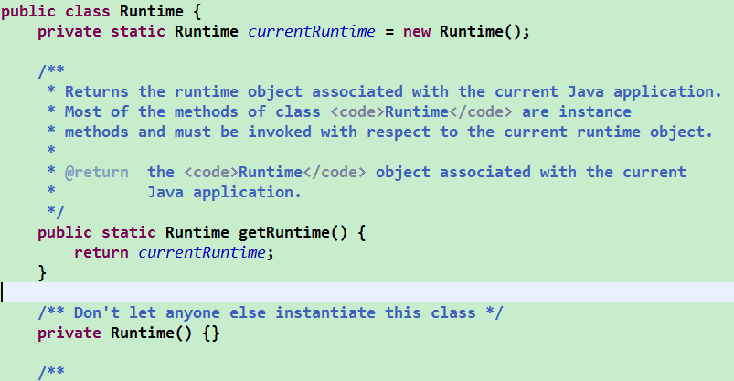

# [java]Singleton单例设计模式

### 单例设计模式

设计模式是在大量的实践中总结和理论化之后优选的代码结构、编程风格、以及解决问题的思考方式。 设计模免去我们自己再思考和摸索。就像是经典的棋谱，不同的棋局，我们用不同的棋谱。 ”套路”  

所谓类的单例设计模式，就是采取一定的方法保证在整个的软件系统中，对某个类只能存在一个对象实例，并且该类只提供一个取得其对象实例的方法。如果我们要让类在一个虚拟机中只能产生一个对象，我们首先必须将类的构造器的访问权限设置为private，这样，就不能用new操作符在类的外部产生类的对象了，但在类内部仍可以产生该类的对象。因为在类的外部开始还无法得到类的对象，只能调用该类的某个静态方法以返回类内部创建的对象，静态方法只能访问类中的静态成员变量，所以，指向类内部产生的该类对象的变量也必须定义成静态的。

### 饿汉式  

饿汉式是天生线程安全的。

```java
class Singleton {
    // 1.私有化构造器
    private Singleton() {}
    // 2.内部提供一个当前类的实例
    // 4.此实例也必须静态化
    
    private static Singleton single = new Singleton();
    
    // 3.提供公共的静态的方法，返回当前类的对象
    public static Singleton getInstance() {
        return single;
    }
}
```

### 懒汉式  

不需要的时候不创建该对象，需要用到时再创建。

懒汉式暂时还存在线程安全问题，讲到多线程时，可修复。

```java
class Singleton {
    // 1.私有化构造器
    private Singleton() {}
    
    // 2.内部提供一个当前类的实例
    // 4.此实例也必须静态化
    private static Singleton single;
    
    // 3.提供公共的静态的方法，返回当前类的对象
    public static Singleton getInstance() {
        if(single == null) {
            single = new Singleton();
        }
        return single;
    }
}
```


### 单例模式的优点

由于单例模式只生成一个实例， 减少了系统性能开销，当一个对象的产生需要比较多的资源时，如读取配置、产生其他依赖对象时，则可以通过在应用启动时直接产生一个单例对象，然后永久驻留内存的方式来解决。

###### 举例 java.lang.Runtime  




### 应用场景  

- 网站的计数器，一般也是单例模式实现，否则难以同步。
- 应用程序的日志应用，一般都使用单例模式实现，这一般是由于共享的日志文件一直处于打开状态，因为只能有一个实例去操作， 否则内容不好追加。
- 数据库连接池的设计一般也是采用单例模式，因为数据库连接是一种数据库资源。
- 项目中， 读取配置文件的类，一般也只有一个对象。没有必要每次使用配置文件数据，都生成一个对象去读取。
- Application 也是单例的典型应用
- Windows的Task Manager (任务管理器)就是很典型的单例模式
- Windows的Recycle Bin (回收站)也是典型的单例应用。在整个系统运行过程中，回收站一直维护着仅有的一个实例。  