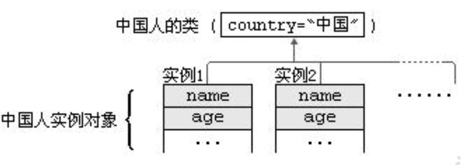

# [java]static

当我们编写一个类时，其实就是在描述其对象的属性和行为，而并没有产生实质上的对象，只有通过new关键字才会产生出对象，这时系统才会分配内存空间给对象，其方法才可以供外部调用。我们有时候希望无论是否产生了对象或无论产生了多少对象的情况下， 某些特定的数据在内存空间里只有一份，例如所有的中国人都有个国家名称，每一个中国人都共享这个国家名称，不必在每一个中国人的实例对象中都单独分配一个用于代表国家名称的变量。  

- 如果想让一个类的所有实例共享数据，就用类变量！  

### 类属性、类方法的设计思想  

类属性作为该类各个对象之间共享的变量。 在设计类时,分析哪些属性不因对象的不同而改变，将这些属性设置为类属性。相应的方法设置为类方法。  

如果方法与调用者无关，则这样的方法通常被声明为类方法，由于不需要创建对象就可以调用类方法，从而简化了方法的调用。  

### 关键字: static

- 使用范围
  - 在Java类中， 可用static修饰属性、 方法、 代码块、 内部类  
- 被修饰后的成员具备以下特点：  
  - 随着类的加载而加载  
  - 优先于对象存在  
  - 修饰的成员，被所有对象所共享  
  - 访问权限允许时，可不创建对象，直接被类调用
  - 