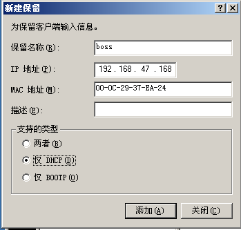

# DHCP部署与安全

### 1. DHCP作用  

（Dynamic Host Configure Protocol）动态主机配置协议

自动分配IP地址  

### 2. DHCP相关概念  

地址池/作用域: 

- IP、子网掩码、网关、DNS、租期
  - 电脑想要正常上网的4大参数：IP、子网掩码、网关、DNS
  - 租期：到期收回，给别人用
- DHCP协议端口是UDP 67/68  

### 3. DHCP优点

- 减少工作量
- 避免IP冲突
- 提高地址利用率

### 4. DHCP原理

也成为DHCP租约过程，分为4个步骤：

###### 1. 客户机发送DHCP Discover广播包

​		客户机广播请求IP地址（包含客户机的MAC地址）

###### 2. 服务器响应DHCP Offer广播包  

​		服务器响应提供的IP地址（但无子网掩码、网关等参数） 

​		可能不止一台服务器响应。

###### 3. 客户机发送DHCP Request广播包  

​		客户机选择IP（也可认为确认使用哪个IP）  

​		因为可能不止一台服务器响应，客户机需要选择使用哪个IP

###### 4. 服务器发送DHCP ACK广播包  

​		服务器确定了租约，并提供网卡详细参数IP、掩码、网关、DNS、租期等

###### 对DHCP的攻击

- kali可以模拟多个客户机，榨干DHCP地址池中的地址。
  - 可用交换机（硬件）进行防御，每次有一台机器插上交换机，就记下MAC地址。
- 客户机将自己的机器也设置成DHCP服务器，并提供家地址，导致同个交换机上的其他电脑获取到家地址而无法上网。
  - 防御方法：禁止交换机上除DHCP服务器所在端口的其他端口发送OFFER包。

### 5. DHCP续约

- 当50%过后，客户机会再次发送DHCP Request包，进行续约。
- 若成功，服务器回应ACK包。

- 如服务器无响应，则继续使用并在87.5%再次DHCP Request包，进行续约。
- 如仍然无响应，并释放IP地址，及重新发送DHCP Discovery广播包来获取IP地址
- 当无任何服务器响应时，自动给自己分配一个169.254.x.x/16,属于全球统一无效地址，用于临时内网通信！  
  - 保证局域网内部可以临时正常通信。

### 6. 部署DHCP服务器

1）IP地址固定（DHCP服务器必须固定IP地址）
2）安装DHCP服务插件(通过安装光盘安装) - DHCP对应端口号：67, 68
3）新建作用域及作用域选项 - 作用域网段与主机地址要一致
4）激活
5）客户机验证：  

```
ipconfig /release 释放IP（取消租约，或者改为手动配置IP，也可以释放租约）
ipconfig /renew 重新获取IP（有IP时，发送request续约，无IP时发送Discovery重新获取IP）
```

### 7. 地址保留  

这对指定的MAC地址，固定动态分配IP地址  



### 8. 选项优先级  

作用域选项>服务器选项

* 当服务器上有多个作用域时，可以在服务器选项上设置DNS服务器  

### 9. DHCP备份  

备份服务器的所有作用域，当服务器宕机后，可以使用备份文件在其他DHCP服务器上进行还原所有配置  


### 10. DHCP攻击与防御  

- 攻击DHCP服务器：频繁的发送伪装DHCP请求，直到将DHCP地址池资源耗尽
  - 防御：在交换机（管理型）的端口上做动态MAC地址绑定
- 伪装DHCP服务器攻击：黑客通过将自己部署为DHCP服务器，为客户机提供非法ip地址
  - 防御：在交换机上（管理型），除合法的DHCP服务器所在接口外，全部设置为禁止发送dhcp offer包  

### 11. 常见小问题  

- 删除作用域时，注意不要删掉服务器