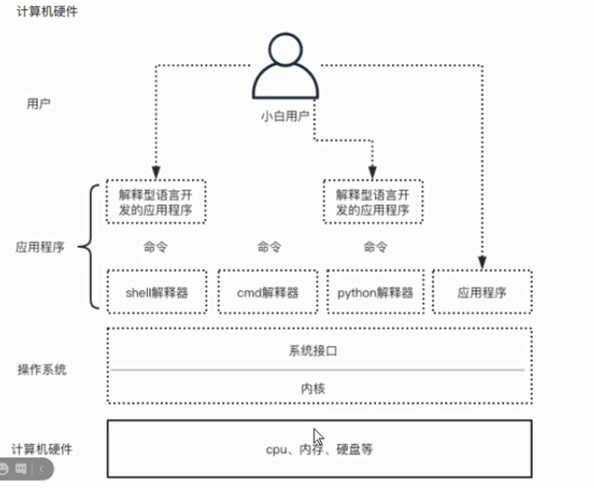

# 计算机硬件组成

### 什么是计算机？

- 计算机诞生的目的是为了取代人力。
- 说到底，计算机就是人类的奴隶。
- 计算机的运行受程序控制
- 可以说程序是计算机的灵魂
- 硬件以外的都叫软件

### 软件

软件分为两大类：

- 操作系统
  - 协调、管理、控制计算机硬件资源的一个控制程序
- 应用软件

### 计算机体系的三层结构

- 应用程序
- 操作系统
  - Linux
  - Windows
  - Mac
- 硬件

### 什么是编程语言？

- 人和人交流用人类的语言
- 人和计算机交流用的语言就是**编程语言**

### 什么是编程？

1. 把想让计算机做的事按步骤想清楚
2. 用一种计算机能听懂的语言（编程语言）把做事的步骤翻译下来

### 为何要编程？

为了让计算机取代人力

### 什么是程序？

程序就是一堆代码文件

