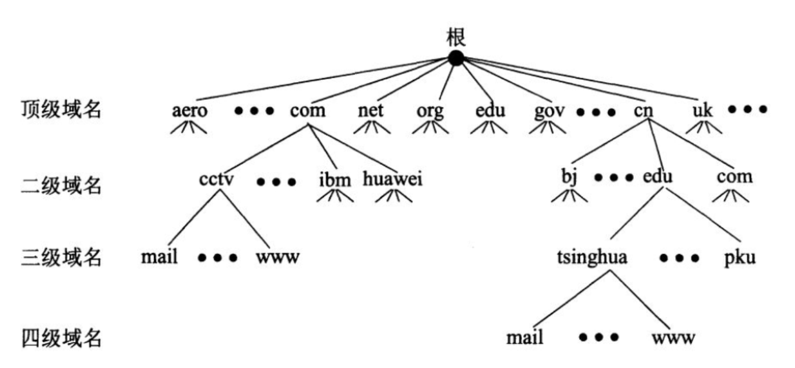
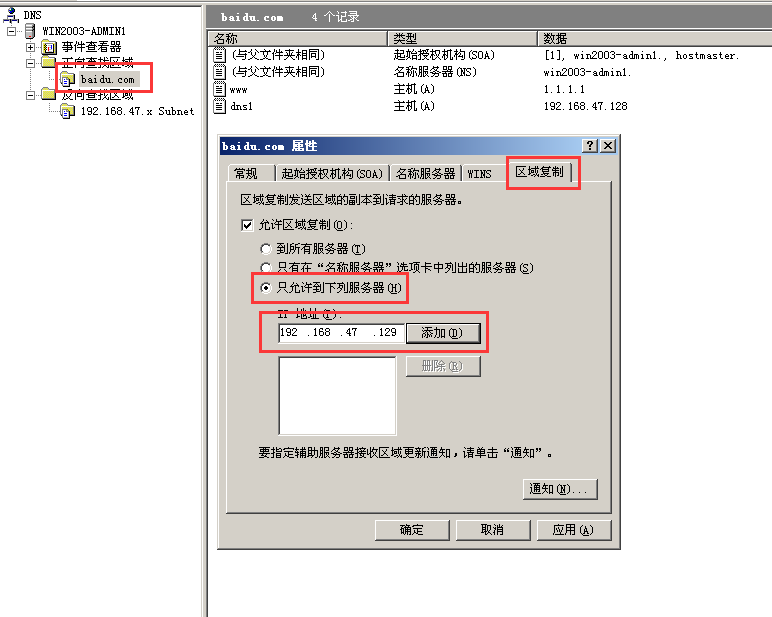
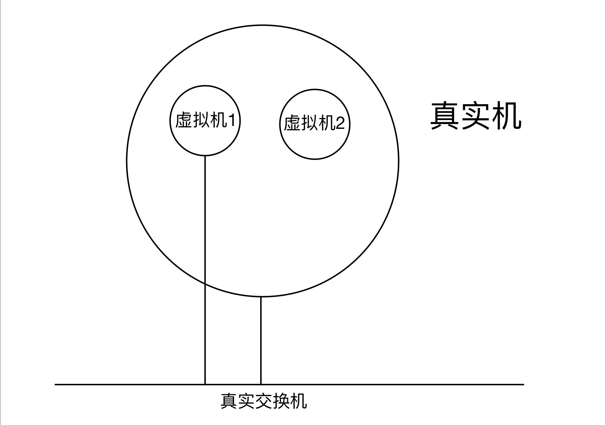

# DNS部署与安全

### 1. DNS

*Domain Name System* 域名系统

作用：为客户机提供域名解析服务


### 2. 域名组成

##### 2.1 域名组成概述

如：“www.sina.com.cn”是一个域名，从严格意义上讲，“sina.com.cn”才被称为域名(全球唯一)，而“www”是主机名。

“主机名.域名”称为完全限定域名(FQDN = *fully qualified domain name*)。一个域名下可以有多个主机，域名全球唯一，那么“主机名.域名”肯定也是全球唯一。

以“sina.com.cn”域名为例，一般管理员在命名其主机的时候会根据其主机的功能而命名。

- 网站的是www，对应的FQDN为www.sina.com.cn
- 博客的是blog，对应的FQDN为blog.sina.com.cn
- 论坛的是bbs，对应的FQDN为bbs.sina.com.cn

这么多个FQDN，然而我们只需要申请一个域名即sina.com.cn即可

##### 2.2 域名组成

###### 树形结构



- 根域 .
- 顶级域
  - 国家顶级域 cn, jp, hk, uk
  - 商业顶级域 
    - com 商业机构
    - gov 政府机构
    - mil 军事机构
    - edu 教育机构
    - org 民间组织架构
    - net 互联网
- 一级域名
- 二级域名
- …

```
如：www.baidu.com. #浏览器会自动加最后那个.(根域)
.为根域
.com为顶级域
baidu为一级域名
www为主机名
```

FQDN=主机名.DNS后缀
FQDN（完整合格的域名）  


### 3. 监听端口

```
TCP 53
UDP 53
```


### 4. DNS解析种类

##### 4.1 按照查询方式分类

```
1）递归查询：客户机与本地DNS服务器之间
2）迭代查询：本地DNS服务器与根等其他DNS服务器的解析过程
```


- 递归查询 - 所问即所答
- 迭代查询 - 所问非所答
- 全世界目前只有13台服务器
- 任何一台DNS服务器，都要知道那13台根服务器
- 若服务器搭建了DNS转发器，先查询本地缓存，若无记录，则转发给另一台DNS服务器
  - 转发器的过程叫递归解析


##### 4.2 按照查询内容分类

- 正向解析：已知域名，解析IP地址
- 反向解析：已知IP地址，解析域名


### DNS服务器搭建过程

1. 要求网卡IP是静态IP地址。
2. 安装DNS服务器插件（也就是安装并开启TCP及UDP53端口）
3. 创建区域文件（负责一个域名后缀的解析，如baidu.com为域名后缀，一台DNS服务器内可存放多个区域文件）
4. 新建A记录    


##### 搭建正向查找区域


- SOA - “baidu.com”的权威服务器，全世界只有这一台。其他全是非权威的。
- NS - Name Server 名称服务器，图中表示现在只有一台服务器可以解析baidu.com（若有辅助DNS服务器，即公司里另一台备份的服务器，则此处显示这个和那个备份的服务器）


此后全世界都可以通过www.baidu.com来访问IP为1.1.1.1的服务器


```bash
ipconfig /flushdns #清空本地dns缓存
ipconfig /displaydns #显示本地缓存的dns
```


出现红框中的内容，因为没有给自己搭建的这个DNS服务器起名。

给DNS服务器起名


##### 搭建反向查找区域


这样就不会有之前红框里的`DNS request time out`


### 6. DNS客户机如何解析  

1. 指向DNS  

2. 手工解析域名：  

   ```bash
   nslookup 域名
   ```

   


### 7. DNS服务器处理域名请求的顺序  

1. DNS高速缓存（必须学会如何查看及清空）  
2. DNS区域配置文件  
3. DNS转发器  
4. 根提示  


### 8. 辅助DNS服务器 / 转发器

假如服务器DNS1需要将DNS request转发给服务器DNS2，让DNS2去做查询，再由DNS2返回结果给DNS1，然后DNS1返回给发出request的电脑。那么我们需要在DNS1上做以下操作：


### 9. 清除DNS缓存  

##### 9.1 客户机上清除缓存  

```bash
ipconfig /flushdns
```


##### 9.2 服务器上清除缓存  

```
windows服务器：dns工具--查看--高级，调出缓存来，然后右键清除缓存
```


### 10. 域名解析记录类型

- A记录： 正向解析记录
- CNAME记录：别名
- PTR记录：反向解析记录
- MX：邮件交换记录  
- NS：域名服务器解析  


### 11. 反向DNS  

nslookup手工解析时，会进行一个反向解析  


### 12. DNS服务器分类  

- 主要名称服务器
- 辅助名称服务器
- 根名称服务器
- 高速缓存名称服务器  


### 13. 客户机域名请求解析顺序  

1. DNS缓存
2. 本地hosts文件
3. 找本地DNS服务器  


### 14. 服务器对域名请求的处理顺序  

1. DNS高速缓存
2. 本地区域解析文件
3. 转发器
4. 根


### 15. 区域复制

在主服务器上（DNS1）：

右键baidu.com，选择属性



在DNS2中：


VMnet1 - VMnet19都是虚拟交换机


VMnet0 不是虚拟交换机，是真实机所在的虚拟机

