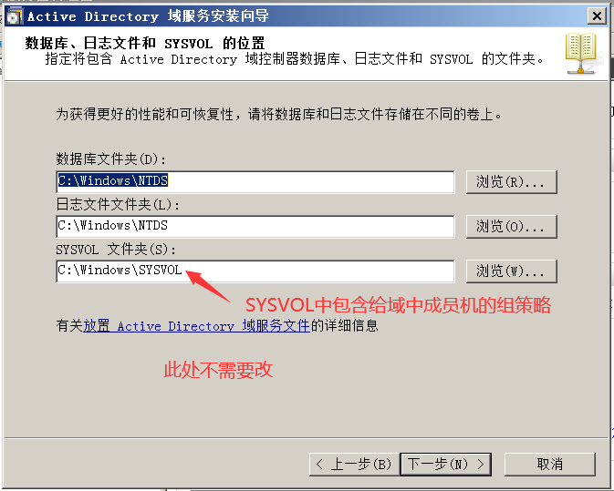
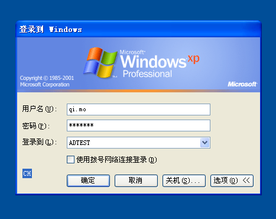
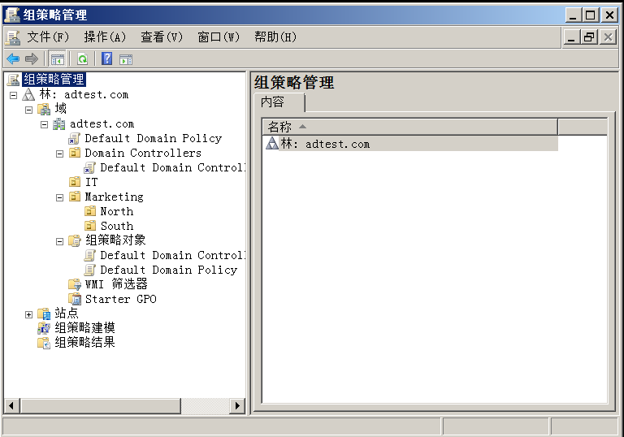

# Domain域

### 1.Domain

### 2.内网环境：

##### 工作组(默认模式)

人人平等，不方便管理

##### 域

人人不平等，集中管理，统一管理

### 3.域的特点

  集中/统一管理

### 4.域的组成

- 域控制器: DC（Domain Controller）
- 成员机

### 5.域的部署

  1）安装域控制器--就生成了域环境
  2）安装了活动目录--就生成了域控制器
  3）活动目录：Active Directory = AD

### 6.活动目录

  1）AD
  2）特点：集中管理/统一管理

### 7.组策略GPO

### 8.部署安装活动目录：

1. 开启2008虚拟机，并桥接到vmnet2
2. 配置静态IP地址192.168.47.128/24
3. 开始-运行-输入dcpromo,安装活动目录。(dcpromo这个命令可用于安装也可用于卸载)
   - 弹出向导：勾选DNS-新林中新建域-功能级别都设置为2003-域的FQDN（adtest.com）--设置目录服务还原密码123.com-勾选安装后重启
   - 
   - 林 - 图一中三角形为一个域，称为一个域树。若有其他域，则形成域林。
   - 
   - 
   - 根据公司具体情况，选择林功能级别。若选择win2003，则此林中所有根域都必须是win2003以上版本。
   - 
   - 
   - 
4. 在DC上登录域qf\administrator
   - DC的本地管理员升级为域管理员
5. 验证AD是否安装成功：
    1. 计算机右键属性-所属域
    2. DNS服务器中是否自动创建qf.com区域文件及
    3. 自动注册DC的域名解析记录
    4. 开始-管理工具-A D 用户和计算机
        - computer：普通域成员机列表
        - Domain Controller：DC列表
        - users：域账号

### 9.PC加入域：

  1.配置IP，并指DNS
  2.计算机右键属性--更改--加入qf.com域
  3.重启加入域后，成功使用域用户登录成员机   

##### win7

##### 域中新建用户

### 10.常见小问题

##### 加入域不成功

- 网络是不是不通！
- 解析是否能成功解析！
- 是否为DNS缓存问题

##### 登入域不成功

- 如XP，已勾选登录域ADTEST，不用再写adtest\qi.mo

##### 域用户的权限

- 建议将域用户加入到普通成员机的本地管理员组中

本地管理员组：administrators

域管理员组：Domain Admins - 一般不要把人往这个组里拉，因为对整个公司有控制权限

### 11. OU：组织单位

organization units

作用：用于归类域资源（域用户、域计算机、域组）

域的作用是下发组策略，而OU是为了归类用户权限

##### 新建OU

有这个图标的才算OU

##### 移动成员

为了以后好找，将该用户对应的计算机也移动到相应OU

### 12. 组策略：Group Policy = GPO

作用：通过组策略可以修改计算机的各种属性，如开始菜单、桌面背景、网络参数等。
***重点：组策略在域中，是基于OU来下发的！！
***组策略在域中下发后，用户的应用顺序是：LSDOU
***在应用过程中，如果出现冲突，后应用的生效！

****正常情况下：LSDOU顺序

上级OU(公司集团)：        桌面：aa      运行：删除

下级OU(IT部)：        桌面：未配置  运行：不删除

下级OU用户结果：桌面：aa      运行：不删除

****下级OU设置了阻止继承：

上级OU：         桌面：aa     运行：删除

下级OU：         桌面：未配置 运行：不删除

下级OU用户结果： 桌面：未配置 运行：不删除

****上级设置了强制：

上级OU：           桌面：aa     运行：删除

下级OU：           桌面：未配置 运行：不删除

下级OU的用户结果： 桌面：aa   运行：删除

注意：当上级强制和下级阻止继承同时设置，强制生效！

红框中全是OU

- 计算机配置 - 对计算机进行配置，和用户无关
- 用户配置 - 对用户配置，无论用户在哪台电脑登录，都用同样的配置

##### LSDOU - 当遇到冲突时，应用最后一个组策略

- L = Local
- S = Site
- D = Domain
- OU = Organization Unit

### 13. 查看已配置组策略

### 14. 强制继承

强制继承已选“强制继承”的配置。

### 15. 阻止继承

下级是什么配置就应用什么，和上级无关。

若同时出现下级阻止，上级强制，则用强制那个配置。

### 16. 实现成员机无须按ctrl+alt+delete，并验证

### 17. 密码策略

### 18. 账户锁定策略

