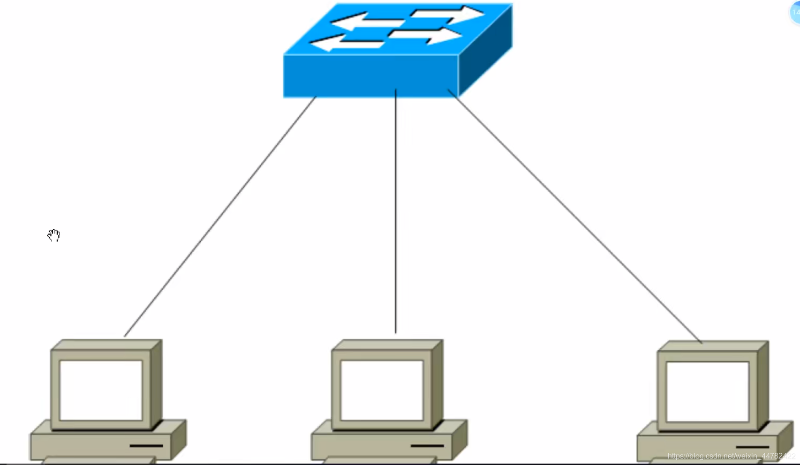
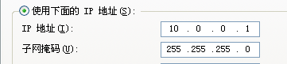
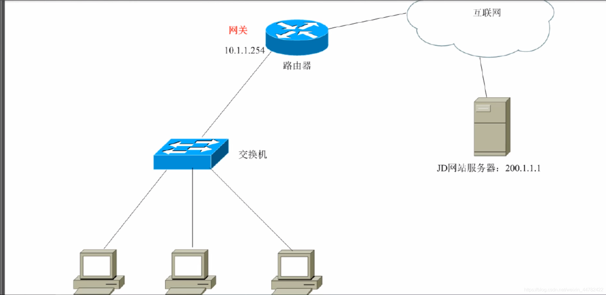
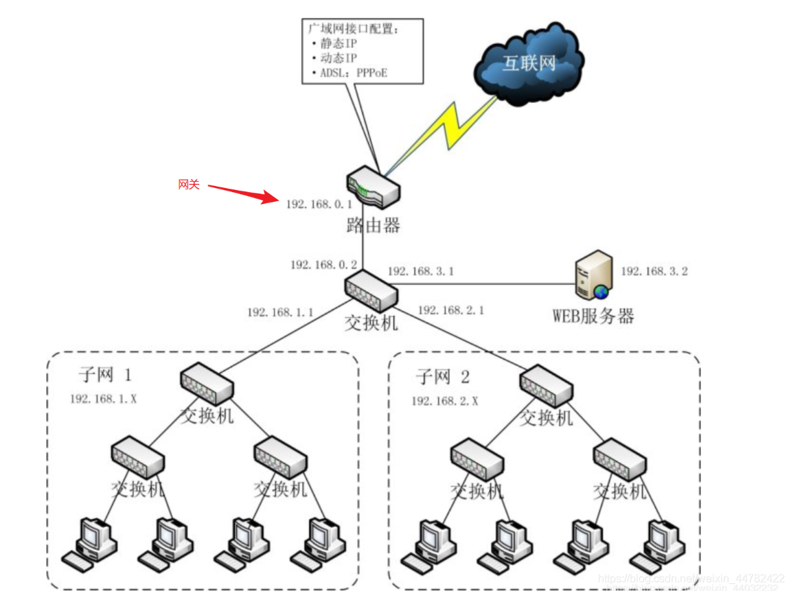
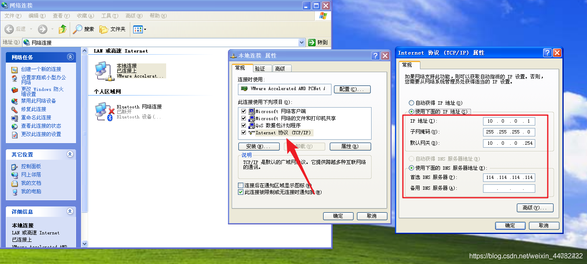
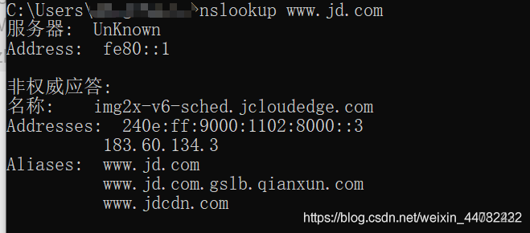

# IP 地址详解

# 简单局域网的构成

局域网（Local Area Network，LAN）是指在某一区域内由多台计算机互联成的计算机组。一般是方圆几千米以内。局域网可以实现文件管理、应用软件共享、打印机共享、工作组内的日程安排、电子邮件和传真通信服务等功能。局域网是封闭型的，可以由办公室内的两台计算机组成，也可以由一个公司内的上千台计算机组成。



交换机是组成局域网的重要设备，但是交换机并不能让设备上网，路由器可以实现设备上网。

局域网：一般称为内网

简单局域网的构成：交换机、网线、PC（其他IT终端）

交换机：用来组建内网的（局域网的）设备

# IP地址

IP地址就是一个唯一的标识，是一段网络编码（二进制），由32位组成

0.0.0.0

00000000.00000000.00000000.00000000 

每8bit组成一个十进制数字，一共4个 （点分十进制）

IP地址形式：X.X.X.X

X的范围：0~255

# 子网掩码

**局域网通信规则**： 在同一个局域网中，所有IP必须在同一网段中才可以互相通信！

**IP地址构成**： 网络位+主机位 （网络位相同的IP地址，为同一网段）

X1.X2.X3.X4 

- 可以X1是网段，X2.X3.X4是主机位
- 可以X1.X2是网段，X3.X4是主机位
- 可以X1.X2.X3是网段，X4是主机位

**子网掩码**： 用来确定IP地址的网络位

**子网掩码如何确认网络位**：与255对应的数字为网络位，与0对应的数字为主机位

255.0.0.0

255.255.0.0

255.255.255.0

```
例：
10.1.1.1 255.255.0.0
获知：10.1.1.1属于10.1.网段，主机名叫.1.1
```

注意： 1个IP地址，必须配套一个子网掩码


# IP地址详解
国际标准组织ISO定义地址分类：五大类（是以IP地址的第一位进行区分的）

A类：1-126 默认子网掩码：255.0.0.0

B类：128-197 默认子网掩码： 255.255.0.0

C类：192-223 默认子网掩码：255.255.255.0

D类：224-239 组播地址 - 一个地址代表一组人

E类：240-254 科研使用

- ABC类为单播地址，每个地址只能配给一个人用
- ABC类的子网掩码可以修改

```
例：
10.1.1.1 255.255.255.0
问：10.1.1.1属于哪个网段？所有网段有多少个可用的IP地址？该网段的广播地址是什么？
答：
10.1.1.1属于10.1.1.0网段
可用IP地址有10.1.1.1 ~ 10.1.1.254
该网段的广播地址是将主机地址完全置为255的时候，即为：10.1.1.255, 可发送消息给该网段所有主机。
	主机位不全是255不是广播地址
```
## 特殊地址
127.0.0.1 回环地址

# 网关
网关：一个网络的出口，Gateway=GW, 一般网关是在路由器上

网关一般是该网段的第一个IP或最后一个IP

192.168.0.1
192.168.0.254

路由器：可用链接内外网的设备



当两台电脑进行通信时：
1. 先比较IP地址并确定是否在同一网段中 
2. 若在同一网段，则直接发出去，而不找网关 
3. 若不在同一网段，则需要发包给网关 （该网段所有机器必须知道网关IP）

# DNS

DNS: Domain Name Service 域名服务器

各大网络运营厂商都有DNS服务器，大城市多一些，小城市少一些

几个DNS服务器IP地址：

1.1.1.1 澳大利亚

8.8.8.8 谷歌（美国）

114.114.114.114 中国

域名系统(Domain Name System, DNS)是Internet上解决网上机器命名的一种系统。就像拜访朋友要先知道别人家怎么走一样，Internet上当一台主机要访问另外一台主机时，必须首先获知其地址，TCP/IP中的IP地址是由四段以“.”分开的数字组成，记起来总是不如名字那么方便，所以，就采用了域名系统来管理名字和IP的对应关系。
作用：通过域名解析真实网络IP地址

# 配置IP地址


# 网络测试命令

### 1. 查看IP地址
```
ipconfig                  # 查看IP地址基本信息
ipconfig /all             # 查看IP地址详细信息
```

### 2. 测试网络连通性
```
ping www.baidu.com            # 测试网络连通性，有去有回即为可以成功通信
ping -l 2000 www.baidu.com    # 每次都发2000个字节 在局域网内最大阈值为65500字节
ping -t www.baidu.com         # 一直ping
ping -n www.baidu.com         # 修改ping包数量

注：若ping不通，可能对方不在线，或者对方开着防火墙！
```

### 3. 手工解析域名
```
nslookup www.jd.com
```
