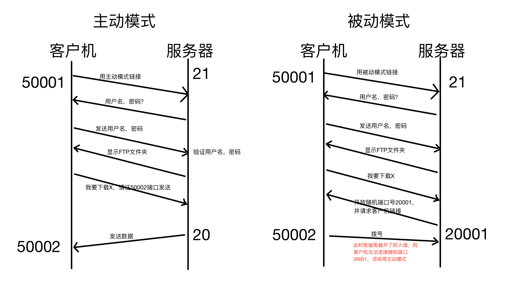
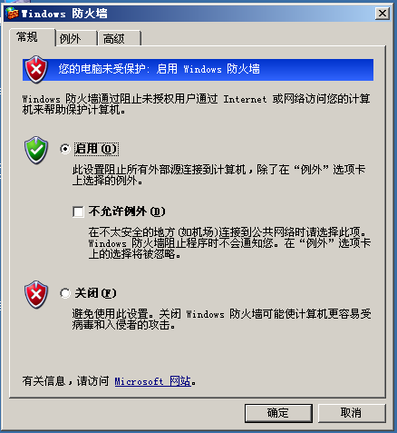
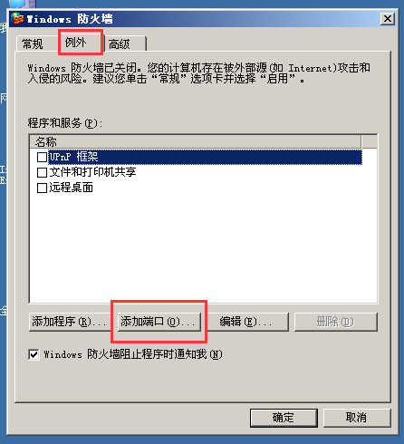
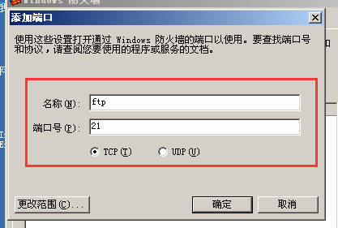
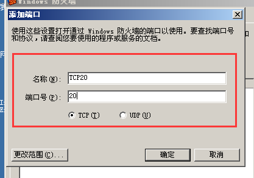
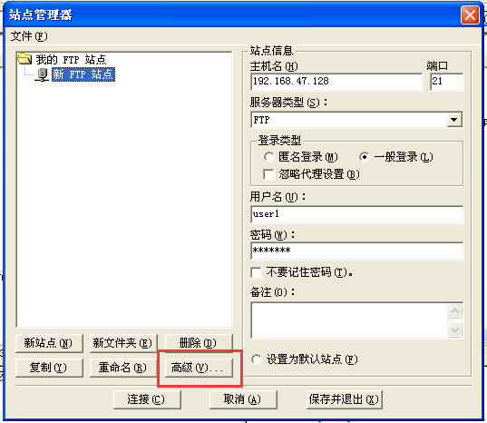
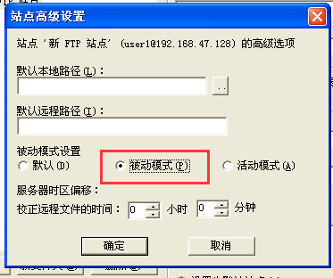
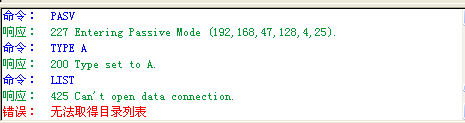
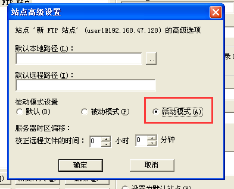
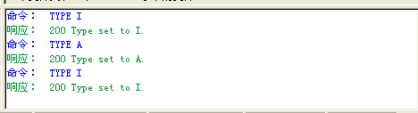

# ISS-FTP服务器

### 1.File Transfer Protocol

  文件传输协议

### 2.端口号

- TCP 20/21

### 3.FTP工作方式

##### 主动模式

- 21端口：控制端口
- 20端口：数据端口

##### 被动模式

- 21端口
- 随机端口作为数据传输端口 - 一般端口号为50000+
- 注意
  - 主被动模式，阐述的是数据传输过程（站在服务器的角度去看）
  - 主被动模式，选择权在客户机上！
  - 主被动模式，所谓主或被是站在服务器的角度

### 4. 部署FTP服务器

1）配置静态IP
2）安装IIS-ftp软件
3）使用默认站点或创建新的站点

​	注意：用户最终权限为FTP权限与NTFS权限取交集

​	建议：FTP权限全部勾选，然后具体的在NTFS里做！
4）去掉匿名访问对勾

### 5. 软件

FTPserver.exe - 小规模

Serv-U - 生产环境

### 6. 服务器开防火墙并开启20,21端口

##### 服务器

##### 客户机

