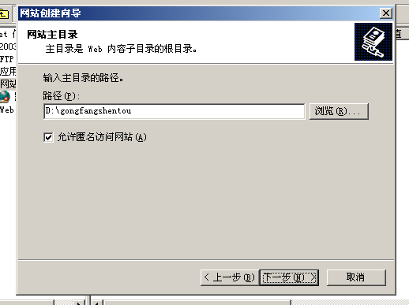

# ISS-WEB服务器

### 1. WEB服务器也称为网页服务器或HTTP服务器

### 2. WEB服务器使用的协议是HTTP或HTTPS

服务器和客户端都能认识和理解这个服务，才能使用这个服务。

### 3. 协议端口号

- HTTP: TCP 80
- HTTPS: TCP 443

### 4. WEB服务器发布软件

- 微软: IIS (可以发布web网站和FTP站点) IIS = Internet Information Services
- Linux: Apache / LAMP / Tomcat / nginx, …
- 第三方: phpstudy, XAMPP (仅限于测试和实验环境，不能用于生产环境)

### 5.部署WEB服务器

1）配置静态IP地址
2）安装IIS-WEB插件
3）停用默认站点
4）新建网站-地址端口绑定-指定站点路径-设置权限
5）设置默认文档（设置首页）

确定 -> 确定 -> 下一步

默认网页在此文件夹下

静态网页只需选择读取

### 6.一台服务器同时发布多个web站点

1）不同的IP，相同的端口
2）相同的IP，不同的端口
3）相同的IP，相同的端口，不同的域名（主机头）

##### 给一台服务器设置多个IP

##### 相同IP,端口号; 不同域名(主机头)

或者

##### 使网站既可用域名访问，也可用ip访问

### 7.网站类型：

##### 静态网站

- 一般扩展名为.html或.htm
- 无后台数据库

##### 动态网站

- 一般扩展名为.asp或.php
- 有后台数据库，asp或php可以连接前台页面与后台数据库

### 8.常见小问题：

1）用域名可以，用IP不行
2）所有IIS配置都没错，但是用域名访问不了。不要忘记指DNS，清空DNS缓存
3）检查一遍，发现所有配置都没问题！
   但一直弹“用户登录”对话框，要检查站点文件夹是否赋予IUSR来宾用户权限

