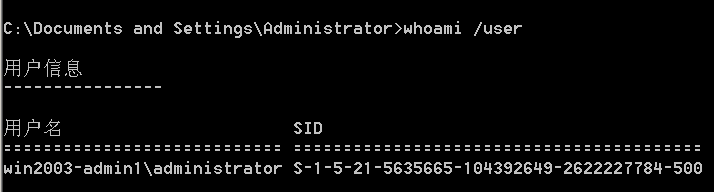
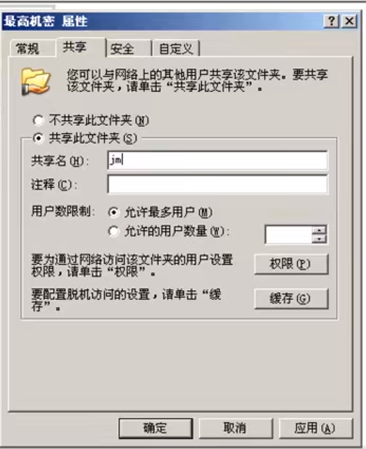
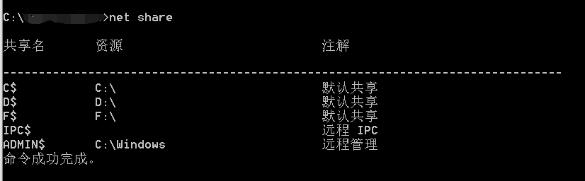
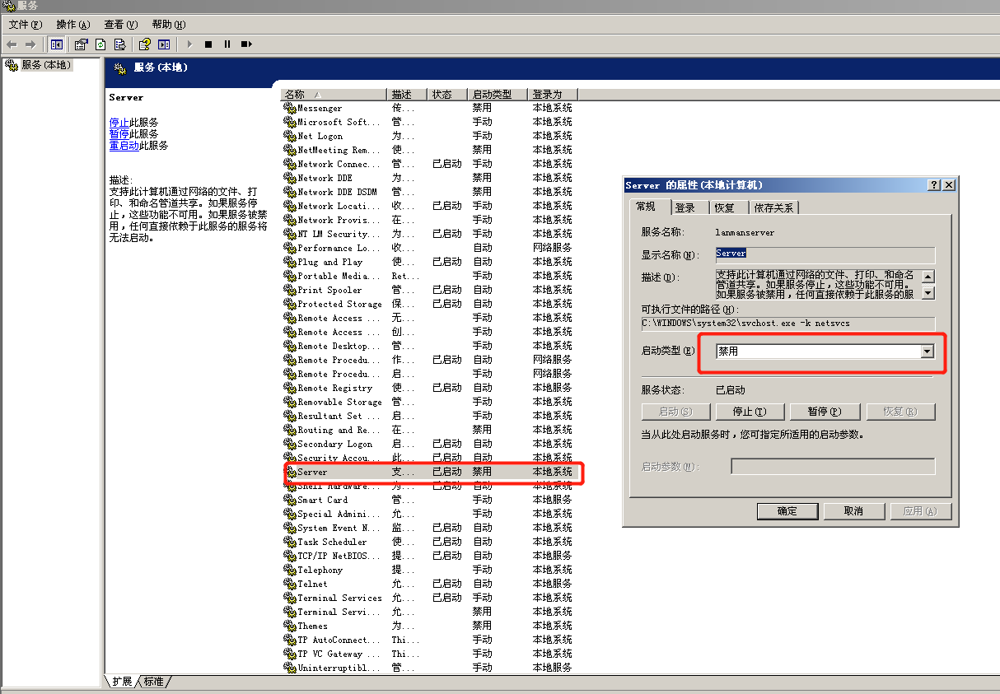
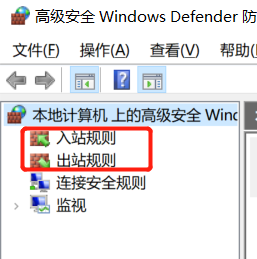
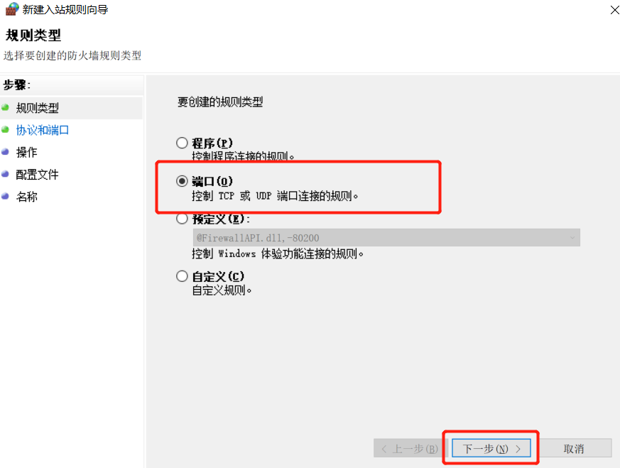
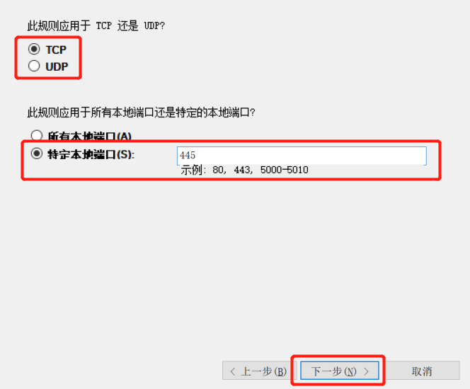

[TOC]

# 文件共享服务器 cifs

cisf服务器是微软开发的，全部Windows系统都内置了这个服务。

### 一、共享服务器概述  

通过网络提供文件共享服务，提供文件下载和上传服务（类似于FTP服务器）  

### 二、创建共享  

在服务器端：

```
方法：文件夹右键属性--共享--开启共享--设置共享名--设置共享权限
```

注：

1）在本地登录时，只受NTFS权限的影响  

2）在远程登录时，将受共享及NTFS权限的共同影响，且取交集！  

3）所以建议设置共享权限为everyone完全控制，然后具体的权限需求在NTFS权限中设置即可。


Win10中：


### 三、访问共享  

```
在开始运行/或我的电脑地址栏中，输入UNC地址：
\\文件共享服务器IP
\\文件共享服务器IP\共享名
```

例：


```
判断题：
服务器上有某文件夹：d:\feifei
服务器IP：10.1.1.1
共享名： f
以下哪种方式可以正常访问该共享？
\\10.1.1.1\d\feifei
\\10.1.1.1\feifei
\\10.1.1.1\d\f
\\10.1.1.1\f 正确
```

##### whoami命令




### 四、创建隐藏的共享  

方法：共享名$  



### 五、访问隐藏共享的方法  

\服务器IP\共享名$ 

 .PNG)

### 六、共享相关命令  

```cmd
net share #列出共享列表
net share 共享名 /del #删除共享
```



`IPC`叫做空连接，远程可访问所有资源，包括C盘D盘等等。

### 七、屏蔽系统隐藏共享自动产生  (只在服务器上可以这么做)

##### 7.1、打开注册表

打开注册表编辑器：`regedit`

##### 7.2、定位共享注册表位置

`HKEY_Local_MACHINE\System\CurrentControlSet\Services\LanmanServer\Parameters\`
右键新建`REG_DWORD`类型的`AutoShareServer `键，值为 0  

### 八、查看本地网络连接状态

`netstat -an  `

### 九、关闭445服务

可以通过关闭445端口来屏蔽病毒传入（如勒索病毒等）
方法1：打开services.msc，并停止及禁用server服务
方法2：禁止被访问445，配置高级安全防火墙-入站规则（在win7及以上系统，win2008及以上系统）  





- 入站规则 - 其他人访问本台主机

- 出站规则 - 本机访问其他人

- 地点： 控制面板 -> 系统和安全 -> Windows Defender 防火墙 -> 高级安全 

- 关闭445操作：右键“入站规则”  (因为445同时支持TCP和UDP，需要关**两次**)

  

  

  