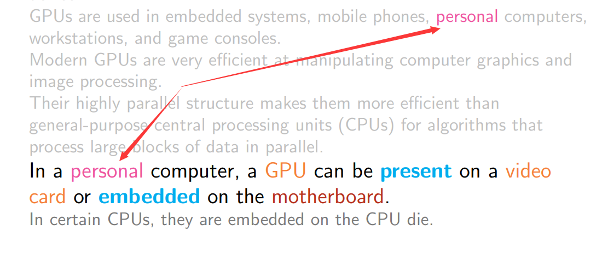

[TOC]


> Simplicity is the ultimate sophistication.    (Leonardo da Vinci )

# 1 - Simplicity

### What this course involves?

- writing
- reading 
- rewriting 
- rewriting
- rewriting

### Crucial

- grammar book
- dictionary
- thesaurus
- crib sheets
- software?

### Imperatives (祈使句？命令？当务之急？)

- practice writing
- read examples of *good* writing
- read examples of *bad* writing
- follow instructions
- improve spelling
- improve grammar
- revise and edit

### How to write good?

1. Avoid Alliteration (典故). Always.
2. Prepositions are not words to end sentences with.
3. Avoid clichés like the the plague. They're old hat.
4. Comparisons are as bad as cliches.
5. Be more or less specific.
6. Writers should never generalize.
7. Seven: Be consistent!
8. Don't be redundant; don't use more words than necessary; it's highly superfluous.
9. Who needs rhetorical questions? 谁需要反问？
10. Exaggeration is a billion times worse than understatement.

### Poor writing

- may be ambiguous - results in misunderstanding by readers.
- may contain omissions (遗漏) - frustration (挫折) by readers.
- may be obscure (晦涩的) - readers struggle to understand the text.
- Poorly presented material carries a subconscious (潜意识的) message.
- Numerous spelling errors → readers are inclined not to believe the writer.
- Sloppy presentation (草率的演讲) → little care taken by writer.

If the ideas are clearly expressed & well organized, then the document should be easy to read.

### Why would someone write something that is unclear?

- Afraid of making mistakes, so every word and phrase are labored over (费尽心思).
- Wishes to impress audience with big words and complicated sentence structures.
- Most frequent problem: writer has difficulty considering text from the audience's point of view.
- When writing about something you know, you may forget to mention things obvious to you.
  - Put yourself in the reader's shoes.
  - Do not omit important details.

### To improve writing

- To write better, read critically.
- Consider whether the text succeeds. How does the text succeed?
- Is the writing clear and direct?
- Is the writing confusing?
- Is the writing too dense?
- Learn from the writing of others
  - both *positive* and *negative* writing examples.

### When writing, one must consider:

- sentence level
- paragraph level
- document level

### Other important aspects

- grammar
- spelling
- coherence
- brevity 简洁
- clarity

### New concepts to understand

- Introductions & Conclusions
- Coherence
- Nominalization
- Syntax
- Grammar
- Passive & Active
- Prose
- Style
- Rhetoric
- Rhetorical Situation
- Genre

# 2 - What is Technical Writing

> Impatience asks for the impossible, wants to reach the goal without the means of getting there.   — Hegel

### What is Technical Writing?

Technical writing is

- how to write using "technical" words?
- knowing when and how to use "technical" words?

### What is non-technical writing?

- creative writing vs. technical writing
- technical article vs. Newspaper article
- Wikipedia?
- Ikea instructions?
- Software Documentation?
- Medicine Labels?
- Recipes?
- Visualizations?

### Technical Writing Examples

- Wikipedia


- Ikea instructions


- Software Documentation
- Medicine Labels
  - Take one aspirin in the morning, another at night. 
  - Do not consume more than two within a 24 hour period. 
- Recipes 食谱
  1. Preheat oven to 350 degrees F (175 degrees C). Mix together
     pancake mix, milk and egg until blended. Set aside.
  2. Pour melted butter in 9-inch pie plate. Place apple slices in
     bottom of pie plate. Sprinkle cinnamon and pecans over
     apples and drizzle syrup over top. Pour batter over apples.
  3. Bake at 350 degrees F (175 degrees C) for 30 minutes or until
     top springs back when touched. Loosen edges and invert onto
     serving platter. Cut into wedges before serving.  

- Visualizations


# 3 - Rubrics 评估准则

> If the path be beautiful, let us not ask where it leads.   — Anatole France

### Content outside the scope of the course

- Legal writing
- Medical writing

### No Rubrics provided in advance

mistakes == learning

You are encouraged to appeal anything and everything in the course!

### Experiential Learning

People learn better by participating and actively doing than passively observing others do things.

(We are given problems and assignments before the topics are discussed.)

You should be doing things **important to you!**

- more meaningful!
- more effort and care
- better retention (less reliance on memorization) 减少对记忆的依赖
- fewer "why are we doing this?" questions

(Ask questions if an assignment, journal, or anything else in the course is unclear.)

### Writing Stages

- Brainstorm
- organize
- rough draft
- edit & revise
- 2nd Draft
- edit & revise
- "final" draft

### Brainstorming

"Whenever we reflect on what we write as we write it, we become self-conscious and lose the flow of that writing, sometimes to the point of near-paralysis. It passes."

DO NOT:

- edit
- stop
- revise
- contemplate (沉思)
- reflect
- slow down
- be concerned with writing something "dumb"

DO:

- keep momentum (保持势头)
- attain flow
- write EVERYTHING **down**

# 4 - Spectrum 光谱

> Put down everything that comes into your head and then you're a writer. But an author is one who can judge his own stuff's worth, without pity, and destroy most of it.   — Collette

### Example sentence to rewrite

```
From my research, we can purchase this software for the company and allow us to save a significant amount of money.
```

**Revised:**

```
Software X will save us $10,000 per year.
```

**Alternative Revised Version:**

```
Software X will save the company $10,000 per year.
```


An **important skill** to develop in this course: quickly explaining differences between the sentence variants.


### Spectrum of Word Edit Types

- redundancy
- concision 简洁
- empty / filler words (adding zero) 填充词
- avoid pronouns 避免代词
- metadiscourse 元话语
  - the writer's thinking and writing: we will explain, show, argue, claim, deny, suggest, contrast, summarize ...
  - the writer's degree of certainty: it seems, perhaps, undoubtedly, I think... ( we call these hedges and intensifiers)
  - the readers' action: consider now, as you might recall, look at the next example...
  - the writing itself and logical connections among its parts: first, second, third,; to begin, finally, therefore, however, consequently..."
- avoid discourse markers 避免话语标记
  - 在语言学中，话语标记是指在句法上独立的一个单词或一个短语，它一般在句中起提示、停顿或过度的作用，大多数时候没有实际意义，如果去掉也不会影响句子的意思。
  - 英语中典型的例子有:
    - oh, well, now, then, you know, I mean
    - the connectives: so, because, and, but, or 等等
- weasel words / hedging 模糊词

### Removing words (most significant type of edit)

- redundancy
- concision 简洁
- empty / filler words (adding zero)
- avoid pronouns
- metadiscourse
- avoid discourse markers

### Replacing words 

- empty / filler words (adding zero)
- avoid discourse markers
- weasel words / hedging 模糊词/模糊陈述


# 5 - Word Choice

> Education… has produced a vast population able to read but unable to distiguish what is worth reading. 

### Word Choice (def)

Finding the words that best reflect and say what you want to say while avoiding to confuse the reader. 

For example: One could refer to “data structure” in any of the following ways:

``` 
Data structure in algorithms.
Data structure
DS
Information Storage Representation. (信息存储表示)
(uncommon, idiosyncratic usage 特殊的用途)
```


### Words: What is wrong with These?

<font color=red>Finding</font> the <font color=red>words</font> that best <font color=red>reflect</font> and <font color=red>say what you want to say </font>while <font color=red>avoiding to confuse</font> the reader. 

- **Finding** - implies *discovery*, *serendipity*(意外发现珍奇事务的本领), *change*…
- **words** - are we defining “*word choice*” or “*words choice*”? It’s “*word choice*”.
- **reflect** - “reflect” is like a mirror, replace it with word “mirror” in the sentence is improper. metaphorical, non-literal
- **say** - words do not speak
- **say what you want to say** - convoluted 费解的
- **you** - avoid (unnecessary) pronouns
- **avoid to confuse** - confusing

Summary: Poor word choice in the definition of “*word choice*”.

**Revision 1**

<font color="red">Selecting</font> the word that <font color="red">most accurately</font> represents what you are <font color="red">trying to say</font> while minimizing ambiguity. 

**Revision 2**

Writing with words that best communicates the writer’s intent while minimizing ambiguity. 

**Revision 3**

Writing with unambiguous words optimizes clarity.


The explicit goal is concision = short sentence + more direct + removing everything unnecessary, confusion, redundant. 


### GPU (example)

Think: 

- Does everyone know what a GPU is?

##### Identify words & phrases to revise

A graphics processing unit (GPU) is a specialized electronic circuit designed to rapidly manipulate and alter memory to accelerate the creation of images in a frame buffer intended for output to a display device. 

GPUs are used in embedded systems, mobile phones, personal computers, workstations, and game consoles. 

Modern GPUs are very efficient at manipulating computer graphics and image processing. 

Their highly parallel structure makes them more efficient than general-purpose central processing units (CPUs) for algorithms that process large blocks of data in parallel. 

In a personal computer, a GPU can be present on a video card or embedded on the motherboard. 

In certain CPUs, they are embedded on the CPU die.  





# Persuasive Essays

### Informative & Persuasive

###### Persuasive

Describes what you plan on doing (e.g., proposal)

​	e.g. “I’ve got an idea for a movie”

###### Informative

Describes what you completed (e.g., postmortem)

​	e.g. “I present to you the finished movie”

Or communicates information to readers. 

###### Top-down approach

Similar to how computing science handles problems, write programs. 

###### High-level overview

The zoom in to fill in the details. 


### Informative Essay

###### Purpose of an informative document:

- communicate information
- record information for future audiences so they can understand **what has been done** and **why**. 
- Sometimes called **informational** or **informative** documents. 
- Informative documents **provide information to those that need it**. 
- Also used when multiple parties want to create a record of terms agreed upon. 
- Or to detail work being done. 

###### Factual and objective

Informative documents:

- record events
- provide details of analyses
- explain how recommendations are based in actual needs. 

### Types of Reports

- progress report
- interim report
- phase report
- final report
- handoff report
- project report
- feasibility report
- cost-benefit report
- professional or technical recommendation 
- design rationale report
- post-mortem
- research report
  - one type of structured research report is the the **IMRaD** structure which follows a familiar convention. 
    - introduction
    - method
    - results
    - discussion

### Persuasive Essay

Presents information that **convinces readers** to agree with your ideas or take your recommended action. 

Provides **information to those who need it to make a decision**. 

Goals are to **articulate your position** and **convince the reader**.

Persuade decision-makers to **approve and fund a proposal**. 

Persuasive essays are **not only persuasive**. 

Persuasive essays:

- present important data
- review existing positions and approaches
- discuss your expertise & suitability for a task

Readers look for:

- feasible ideas
- details in the analyses
- how the proposed work would result in benefits

Proposals are written by employees of an organization to “*record and analyze large amounts of data and complex arguments required in a decision-making process*”. 

###### Internal proposals  内部建议

Internal proposals could advise for:

- products, features, training, or equipment
- “suggest a current practice be reconsidered”
- “detail ideas about new policies and processes”

###### Managers & Technical Experts

- Audiences for **proposals** or **business plans** are mixed. 
- Each has different **information** and **reasoning** needs. 
- The audience can include **managers**, **technical staff**, and **administrative staff**. 

###### Manager’s job involves:

- oversee **many** projects and responsibilities simultaneously
- want **big picture** information rather than technical details
- **will not have time** to thoroughly read your proposal
- they will **skim** for **information they need to know**

###### Managers expect the following information in certain sections of a document:

- *overview of project* in **project summary**
- the *project’s feasibility* in **project summary**
- *projected costs* in **budget section** or a **forecast of financial benefits**. 
- *schedule for completion* in **timeline**
- *evidence how each team member is qualified*. 

###### Technical Experts expect the following information in certain sections of a document:

- technical details in your description of **objectives**, **proposed activities**, and **project schedule**. 
- whether your **budget is realistic**
- *evidence how each team member is qualified*. 

###### Managers have little time

Therefore, they ***love pictures***.

They want to understand the *main ideas of your proposal*. 

Don’t include illustrations for the hell of it! Always have a reason for doing something.

Only illustrate concepts **important to proposal’s main ideas**. 

**Technical experts** *closely examine* proposal’s body to *evaluate author’s expertise & qualifications*. 

**Technical experts** expect illustrations need to be *accurate* and *follow conventions & guidelines* of the discipline.  

###### Use the audience’s term & values

To be persuasive, choose:

- the facts you present as evidence
- the kinds of arguments you make (e.g., economic, efficiency, safety, innovation)
- the words you use based on understanding your audience’s *values*, *goals*, and *understanding* of the current problem environment. 

### Types of Persuasive Documents

- proposal
- business plan

###### Proposals are written:

- to suggest an improvement to current processes
- to gain approval to begin a project
- to compete for outside funding
- to negotiate a project

###### concept papers / white papers

Brief, preliminary, unsolicited proposals targeting external organizations so as to *gauge interest in your idea* to determine if you should take the next step (i.e., develop a full, formal proposal for funding).  

software developers would propose a feature to a multi-disciplinary team before starting the coding. 

### Parts of a Proposal

All proposals have an “**Introduction**” section that introduces *the context of the problem* (rarely sometimes called “*Background*” or “*Context*”).

A proposal that employs **visual cues** (e.g., titles & headings) is more likely to be approved at the first stage compared to a proposal that is **difficult to visually navigate**.  

**Headings** and **sub-headings** helps readers follow the logic and overall structure of the proposal. 

**Write informative headings** that *describe the content* (and does not) just label parts of the document’s structure. 

Instead of naming the first section “**Introduction**”, summarize the ideas contained within that section:
		*Growth of Cryptocurrency Threatens Brokerages*
Use **formatting** to show expected conventions are satisfied.  

###### Parts

- Front Matter
- Project Summary or Executive Summary  
- Introduction  
- Project Description  
- Objectives  
- Activities and Timeline  
- Budget  
- Qualifications  
- Appendices  

###### Mission Statement

Organization’s purpose. Defines the reason for its existence. Helps guide internal decision-making while communicating the organization’s mission to customers.  

To be the most customer-centric company in the world, where people can find and discover anything they want to buy online. (Amazon)  

We are a global family with a proud heritage passionately committed to providing personal mobility for people around the world. (Ford Motor Company)

###### Executive Summary

The first section of a business plan but written at the end of the writing process.
Highlight the **strengths** of the business plan. Convince busy readers to read the entire document.
A one-page **executive summary** (usually the only part executives read!).  

###### Company Description

A brief, **high-level overview** of the business for readers to quickly understand the business goal and the company’s *unique proposition*.  

###### Organization & Management  

Overview of company’s organizational structure.  

###### Service or Product Line  

Describes the service or product, focusing on how it benefits customers.  

###### Market Analysis  

Demonstrates your knowledge of the industry and market you plan to enter.
Includes *research findings* and *conclusions*. 

###### Marketing  

Focuses on the company’s marketing strategy  

###### Cash Flow Statement  

An account of the revenues & expenses over a specific period of time (quarter, year).
Allows understanding of current & future needs and how cash flow will impact the company’s growth.
Where money came from (or will come from) and where it went (or will go)  

One component of the financial documents required to manage a business (along with a balance sheet and income statement).  

###### Organized into three sections:

- **Operating Activities**: sales of goods or services
- **Investing Activities**: sale or purchase of an asset
- **Financing Activities**: borrowing funds or selling stock  

###### Funding Request  

Provides information about what funding the business requires and how the funds will be used.
Address **all questions** potential funders will have.  

Represent the information in this section with **charts** and **graphs**!  

###### Appendix  

Include additional information in the **appendix** if it **does not belong to one of the above sections** or is **too lengthy compared to the other sections** of the business plan.  