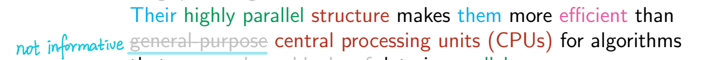
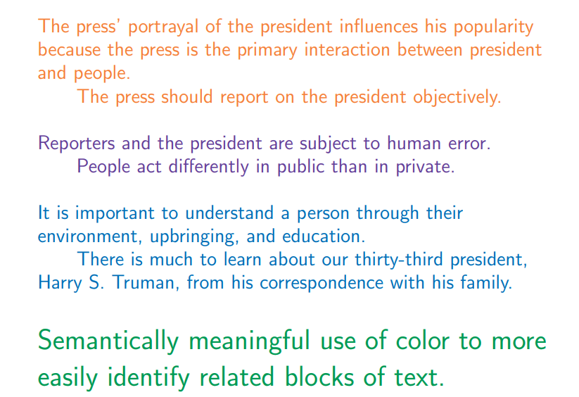

[TOC]


> Simplicity is the ultimate sophistication.    (Leonardo da Vinci )

# Words

## 1 - Simplicity

### What this course involves?

- writing
- reading 
- rewriting 
- rewriting
- rewriting

### Crucial

- grammar book
- dictionary
- thesaurus
- crib sheets
- software?

### Imperatives (祈使句？命令？当务之急？)

- practice writing
- read examples of *good* writing
- read examples of *bad* writing
- follow instructions
- improve spelling
- improve grammar
- revise and edit

### How to write good?

1. Avoid Alliteration (典故). Always.
2. Prepositions are not words to end sentences with.
3. Avoid clichés like the the plague. They're old hat.
4. Comparisons are as bad as cliches.
5. Be more or less specific.
6. Writers should never generalize.
7. Seven: Be consistent!
8. Don't be redundant; don't use more words than necessary; it's highly superfluous.
9. Who needs rhetorical questions? 谁需要反问？
10. Exaggeration is a billion times worse than understatement.

### Poor writing

- may be ambiguous - results in misunderstanding by readers.
- may contain omissions (遗漏) - frustration (挫折) by readers.
- may be obscure (晦涩的) - readers struggle to understand the text.
- Poorly presented material carries a subconscious (潜意识的) message.
- Numerous spelling errors → readers are inclined not to believe the writer.
- Sloppy presentation (草率的演讲) → little care taken by writer.

If the ideas are clearly expressed & well organized, then the document should be easy to read.

### Why would someone write something that is unclear?

- Afraid of making mistakes, so every word and phrase are labored over (费尽心思).
- Wishes to impress audience with big words and complicated sentence structures.
- Most frequent problem: writer has difficulty considering text from the audience's point of view.
- When writing about something you know, you may forget to mention things obvious to you.
  - Put yourself in the reader's shoes.
  - Do not omit important details.

### To improve writing

- To write better, read critically.
- Consider whether the text succeeds. How does the text succeed?
- Is the writing clear and direct?
- Is the writing confusing?
- Is the writing too dense?
- Learn from the writing of others
  - both *positive* and *negative* writing examples.

### When writing, one must consider:

- sentence level
- paragraph level
- document level

### Other important aspects

- grammar
- spelling
- coherence
- brevity 简洁
- clarity

### New concepts to understand

- Introductions & Conclusions
- Coherence
- Nominalization
- Syntax
- Grammar
- Passive & Active
- Prose
- Style
- Rhetoric
- Rhetorical Situation
- Genre

## 2 - What is Technical Writing

> Impatience asks for the impossible, wants to reach the goal without the means of getting there.   — Hegel

### What is Technical Writing?

Technical writing is

- how to write using "technical" words?
- knowing when and how to use "technical" words?

### What is non-technical writing?

- creative writing vs. technical writing
- technical article vs. Newspaper article
- Wikipedia?
- Ikea instructions?
- Software Documentation?
- Medicine Labels?
- Recipes?
- Visualizations?

### Technical Writing Examples

- Wikipedia


- Ikea instructions


- Software Documentation
- Medicine Labels
  - Take one aspirin in the morning, another at night. 
  - Do not consume more than two within a 24 hour period. 
- Recipes 食谱
  1. Preheat oven to 350 degrees F (175 degrees C). Mix together
     pancake mix, milk and egg until blended. Set aside.
  2. Pour melted butter in 9-inch pie plate. Place apple slices in
     bottom of pie plate. Sprinkle cinnamon and pecans over
     apples and drizzle syrup over top. Pour batter over apples.
  3. Bake at 350 degrees F (175 degrees C) for 30 minutes or until
     top springs back when touched. Loosen edges and invert onto
     serving platter. Cut into wedges before serving.  

- Visualizations


## 3 - Rubrics 评估准则

> If the path be beautiful, let us not ask where it leads.   — Anatole France

### Content outside the scope of the course

- Legal writing
- Medical writing

### No Rubrics provided in advance

mistakes == learning

You are encouraged to appeal anything and everything in the course!

### Experiential Learning

People learn better by participating and actively doing than passively observing others do things.

(We are given problems and assignments before the topics are discussed.)

You should be doing things **important to you!**

- more meaningful!
- more effort and care
- better retention (less reliance on memorization) 减少对记忆的依赖
- fewer "why are we doing this?" questions

(Ask questions if an assignment, journal, or anything else in the course is unclear.)

### Writing Stages

- Brainstorm
- organize
- rough draft
- edit & revise
- 2nd Draft
- edit & revise
- "final" draft

### Brainstorming

"Whenever we reflect on what we write as we write it, we become self-conscious and lose the flow of that writing, sometimes to the point of near-paralysis. It passes."

DO NOT:

- edit
- stop
- revise
- contemplate (沉思)
- reflect
- slow down
- be concerned with writing something "dumb"

DO:

- keep momentum (保持势头)
- attain flow
- write EVERYTHING **down**

## 4 - Spectrum 光谱

> Put down everything that comes into your head and then you're a writer. But an author is one who can judge his own stuff's worth, without pity, and destroy most of it.   — Collette

### Example sentence to rewrite

```
From my research, we can purchase this software for the company and allow us to save a significant amount of money.
```

**Revised:**

```
Software X will save us $10,000 per year.
```

**Alternative Revised Version:**

```
Software X will save the company $10,000 per year.
```


An **important skill** to develop in this course: quickly explaining differences between the sentence variants.


### Spectrum of Word Edit Types

- redundancy
- concision 简洁
- empty / filler words (adding zero) 填充词
- avoid pronouns 避免代词
- metadiscourse 元话语
  - the writer's thinking and writing: we will explain, show, argue, claim, deny, suggest, contrast, summarize ...
  - the writer's degree of certainty: it seems, perhaps, undoubtedly, I think... ( we call these hedges and intensifiers)
  - the readers' action: consider now, as you might recall, look at the next example...
  - the writing itself and logical connections among its parts: first, second, third,; to begin, finally, therefore, however, consequently..."
- avoid discourse markers 避免话语标记
  - 在语言学中，话语标记是指在句法上独立的一个单词或一个短语，它一般在句中起提示、停顿或过度的作用，大多数时候没有实际意义，如果去掉也不会影响句子的意思。
  - 英语中典型的例子有:
    - oh, well, now, then, you know, I mean
    - the connectives: so, because, and, but, or 等等
- weasel words / hedging 模糊词

### Removing words (most significant type of edit)

- redundancy
- concision 简洁
- empty / filler words (adding zero)
- avoid pronouns
- metadiscourse
- avoid discourse markers

### Replacing words 

- empty / filler words (adding zero)
- avoid discourse markers
- weasel words / hedging 模糊词/模糊陈述


## 5 - Word Choice

> Education… has produced a vast population able to read but unable to distiguish what is worth reading. 

### Word Choice (def)

Finding the words that best reflect and say what you want to say while avoiding to confuse the reader. 

For example: One could refer to “data structure” in any of the following ways:

``` 
Data structure in algorithms.
Data structure
DS
Information Storage Representation. (信息存储表示)
(uncommon, idiosyncratic usage 特殊的用途)
```


### Words: What is wrong with These?

<font color=red>Finding</font> the <font color=red>words</font> that best <font color=red>reflect</font> and <font color=red>say what you want to say </font>while <font color=red>avoiding to confuse</font> the reader. 

- **Finding** - implies *discovery*, *serendipity*(意外发现珍奇事务的本领), *change*…
- **words** - are we defining “*word choice*” or “*words choice*”? It’s “*word choice*”.
- **reflect** - “reflect” is like a mirror, replace it with word “mirror” in the sentence is improper. metaphorical, non-literal
- **say** - words do not speak
- **say what you want to say** - convoluted 费解的
- **you** - avoid (unnecessary) pronouns
- **avoid to confuse** - confusing

Summary: Poor word choice in the definition of “*word choice*”.

**Revision 1**

<font color="red">Selecting</font> the word that <font color="red">most accurately</font> represents what you are <font color="red">trying to say</font> while minimizing ambiguity. 

**Revision 2**

Writing with words that best communicates the writer’s intent while minimizing ambiguity. 

**Revision 3**

Writing with unambiguous words optimizes clarity.


The explicit goal is concision = short sentence + more direct + removing everything unnecessary, confusion, redundant. 


### GPU (example)

Think: 

- Does everyone know what a GPU is?

##### Identify words & phrases to revise

A graphics processing unit (GPU) is a specialized electronic circuit designed to rapidly manipulate and alter memory to accelerate the creation of images in a frame buffer intended for output to a display device. 

GPUs are used in embedded systems, mobile phones, personal computers, workstations, and game consoles. 

Modern GPUs are very efficient at manipulating computer graphics and image processing. 

Their highly parallel structure makes them more efficient than general-purpose central processing units (CPUs) for algorithms that process large blocks of data in parallel. 

In a personal computer, a GPU can be present on a video card or embedded on the motherboard. 

In certain CPUs, they are embedded on the CPU die.  





## 6 - Empty Word

> A writer is someone for whom writing is more difficult than it is for other people.  – Thomas Mann

### Non-content words

- function words 虚词，没有实际意义的词
- <font color=purple> make, is, be, do, can, that, a, of, the, and </font>
- words that have a functional purpose within language (e.g., grammar, agreement, nominalization, etc)
- determiners (限定词)
- conjunctions (连词)
- prepositions (介词)
- pronouns (代词)
- auxiliary verbs (助动词)
- modals (情态动词)
- qualifiers (限定词)
- question words (疑问词)
- empty words make sentences longer without adding information

e.g. 

- Words <font color=red>that have a</font> functional role <font color=red>make</font> sentences longer, <<font color=red>which make it</font> difficult <font color=red>for</font> readers <font color=red>to</font> read <font color=red>the</font> writing. 
- Rewrite: functional words lengthen sentences. Long sentences are difficult to read. 

e.g. 

- <font color=red>An</font> over-reliance <font color=red>on</font> technology can <font color=red>be</font> mitigated <font color=red>by an</font> awareness of <font color=red>the</font> ways <font color=red>that</font> it enhances our existing ability <font color=red>to</font> work. 

- Re-format:

  ```
  An over-reliance
  	on technology
  		can be mitigated
  			by an awareness
  				of the ways
  					that it enhances our existing ability
  						to work.
  ```

- Re-write: ~~An~~ over-reliance on technology ~~can be~~ mitigated by ~~an~~ awareness of ~~the~~ ways ~~that~~ it enhances our existing ability ~~to~~ work. 

  - **Over-reliance** on technology **is mitigated** by awareness of **ways it** enhances work.

- Note: Removing words was the primary edit, where “can be” was replaced with “is” to satisfy grammatical constraints.

- Edit further: Awareness of how technology enhances work mitigates overly relying on technology.

### Conjunctions

##### e.g.

###### Informal

- **But** we hope to write an agreement today. 

###### Formal

- **However**, we look forward to writing an agreement today. 

- **Nevertheless**, we look forward to completing the agreement today. 

##### e.g. 

###### Informal

- **And** Clare is skilled in writing reports.

###### Formal

- **In addition**, Clare is skilled in writing reports.
- **Furthermore**, Clare is a skillful report writer. 

### Discourse Markers 话语标记

语言学中，话语标记是指在句法上独立的一个单词或一个短语，它一般在句中起提示、停顿或过度的作用，大多数时候没有实际意义，如果去掉也不会影响句子意思。

英语中典型的例子有 oh, well, now, then, you know, I mean, so, because, and, but, or 等等。

In general, **avoid discourse markers**.

Examples:

- In addition…
- Furthermore…
- However…
- Nevertheless…

Why?

- overused
- equivalent to cliches 相当于陈词滥调
- easy sign/trait of a poor writer

Similarly, **avoid metaphors** (比喻)

### Weasel Words & Hedging 模糊词

Words to avoid in educational writing:

- obviously
- simply
- just
- basically
- of course
- clearly
- just
- everyone knows
- However
- So (开头So不行)
- Easy (Alter X and Y coordinates to move the element to the new location. Easy.)

###### Why is hedging bad?

hedging 模糊陈述

The writer:

- appears uncertain
- lacks confidence
- feels disingenuous 虚伪的,不诚实的
- sounds condescending 表现出优越感
- loses the reader’s trust
- loses credibility from readers 失去了读者的信誉


## Quiz

###### Remove pronouns

- 原句: If **you** are unable to explain **it**, then **it** usually means **you** don’t understand the the topic **yourself**. 
- 我: The topic can not be explained without understandings. (4.5/5)
- 答案: Being unable to explain a topic reflects a lack of understanding of the topic.

###### Rewrite the following sentence so it is concise

- 原句: There are those who claim that the internet, a common and widely used online source of information, can be a positive or negative influence on students, depending on the way that it is used.

- 我: Depending on the way students use the internet, the widely used online information can influence students positively or negatively. (4/5)

- 答案: Concision means to write a sentence using fewer words (or concepts, since having readers remember many concepts is difficult). Sample rewrite:

  The internet influences students depending on how it is used.

###### removing redundancy

- 原句: In the present day, Amazon is one of those corporations that has cemented itself as one of the largest technological giants of our generation, leaving no question about Amazon’s calibre as a company focused on leading the world into a better future.
- 我: Amazon, one of the largest technological giants of our generation, focuses on leading the world into a better future. (4.5/5)
- 答案: The following are instances of redundancy:
  - "*in the present day*"
  - "*one of those corporations*"
  - "*leaving no question about*"
  - "*leading the world*"
  - "*into a better future*"
  - "*cemented itself*"
  - "*of our generation*"
  - "*calibre as a*"


## 7 - Subjects, Verbs, Metadiscourse

> I once told a columnist working for me that I had to rewrite his column just so I could throw it out. – pierre Berton

### Subjects & Verbs

- The **subject** performs the *action* of the sentence.
- can be a simple subject, or something more complex. 
- A **simple subject** is composed of a single pronoun, noun, or noun phrase. 
- The **whole subject** (used by text) or **complex subject** (used by others) consists of a noun phrase and any words, phrases, or clauses that modify it. 

###### e.g.

**The students** despised my examples. 

**The students in CMPT-376** despised my examples. 

###### Questions

**What are actions?**

- Actions are verbs

**What are characters?**

- Characters are nouns

**“Characters” are a misnomer. Why?**


### Structure of a sentence:

<font color=purple>Subject</font> <font color=green>Verb</font> <font color=blue>Object</font>. 

<font color=purple>主</font> <font color=green>谓</font> <font color=blue>宾</font>. 

<font color=purple>Main Character</font> <font color=green>Action</font> <font color=blue>Secondary Character</font>. 

<font color=purple>The thing doing the action</font> <font color=green>Action performed</font> <font color=blue>The thing the action is applied to</font>. 

**e.g.**

A comparison was made of the effects of the two hashing schemes on our algorithm’s running time. 

**Rewrite:**

We compared the effects of the two hashing schemes on our algorithm’s running time. 

**Edits made:**

Abstract noun (*comparison*) changed to a verb (*compare*).

- In the original sentence, the subject is the abstract noun *comparison* and the verb is *was made*.
- In the rewrite, the subject is *we* and verb is *compared*.

This can still be improved. *we* is a pronoun, need to be replaced. 

**Rewrite2:**

The effects of two hashing schemes on algorithm X’s running time were compared. 

Two hashing schemes for algorithm X were evaluated for run time. 


### Metadiscourse

**e.g.**

Talking (or writing) about what you are talking (or writing) about. 

**Result**: a periphrastic text

**e.g.**

In <font color=skyblue>this paper</font>, <font color=red>we</font> <font color=orange>perform an experiment</font> that <font color=red>investigates</font> whether GPU-optimized code performs better than code running on both GPU and CPU. 

**Rewrite:**

~~In <font color=skyblue>this paper</font>,~~ <font color=red>We</font> ~~<font color=orange>perform an experiment</font> that~~ <font color=red>investigate</font> whether GPU-optimized code performs better than code running on both GPU and CPU. 


## 8 - Nominalizations

> Substitute ‘damn’ every time you’re inclined to write ‘very’; your editor will delete it and the writing will be just as it should be. – Mark Twain

### Nominalizations: Verbs

| Nominalization | Verb      |
| -------------- | --------- |
| analysis       | analyze   |
| comparison     | compare   |
| conclusion     | conclude  |
| determination  | determine |
| failure        | fail      |
| reaction       | react     |
| belief         | believe   |
| suggestion     | suggest   |

### Nominalization: Adjective

| Nominalization | Adjective |
| -------------- | --------- |
| carelessness   | careless  |
| difficulty     | difficult |
| intensity      | intense   |


### Example

- His carelessness in driving caused an accident. 
- His careless driving caused an accident. 

In the programming environment, the difference of the last 2 sentences would be:

- Interface -> different -> different implementation. 

- Behaviour -> same -> same functionality.’

**Nominalization is the subject of an empty verb (make, give, be, have, do, is, etc.):**

- His careless driving caused an accident.
- He drove carelessly and caused an accident.


- The expectation of the student is to pass the course. 
- The student expects to pass the course. 

**Nominalization follows an empty verb:**

- The defense counsel made an objection to the prosecution’s question. 
- The defense counsel objected to the prosecution’s question.

**One nominalization is the subject of an empty verb and a second nominalization follows it:**

- A revision of the program will improve services for clients.
- If we revise the program then we can serve the clients more efficiently.

**A nominalization follows “there is” or “there are”:**

- There was considerable erosion of the land from the floods.
- The floods considerably eroded the land.
- The land was considerably eroded by the floods. 

**2 or 3 consecutive nominalizations are joined by prepositions:**

- We conducted a study of the distribution of the data. 

  ```
  We conducted a study
  	of the distribution
  		of the data
  ```

- We studied the distribution of the data. 

- We studied how the data was distributed.


## Quiz

###### **removing the metadiscourse**

- 原句：*Our company's profits are represented by the chart on the Powerpoint slide we are showing on the projector.*

- 我：Our company's profits are represented by the chart. (3/5)

- 解析：The instances of metadiscourse are:

  - "Our"
  - "the chart"
  - "the Powerpoint slide"
  - "we"
  - "the projector"

  One possible rewrite:

  *The chart shows our company's profits.*

###### Remove the nominalizations from the sentence:

- 原句：*The assumption that the ability to be creative has a relationship to intelligence warrants further examination.*
- 我：The assumption that creative ability relates to intelligence warrants further examination. (2/5)
- 答案：*The assumption that the ability to be creative has a relationship to intelligence warrants further examination.*

###### Why is it recommended to remove metadiscourse? 

- Metadiscourse makes sentences longer
- Metadiscourse fails to convey impartiality
- Metadiscourse is unimportant and irrelevant
- Metadiscourse focuses the discussion on the communication process instead of the message being communicated

###### Complex subjects are:

- composed from simple subjects and modifiers

###### Why do people communicate using technical terms? 

- Technical terms are convenient shorthand
- Product of the environment


# Sentences

## 11 - Pause To Reflect On Words

>  Everyone, left to their own devices, forms an idea about what goes on in language which is very far from the truth. – Ferdinand de Saussure  

### Journals

- How much time should I spend writing a journal entry?"
- As with everything else, as little time as possible.
- Do not spend years perfecting toward a masterpiece.  
- Instead, spend 10 seconds writing something high quality & impressive.  

### Pause To Reflect: Words  

- This is not a spelling bee.
- This is about communicating so everyone can understand us.  


## 12 - Elegance Code

> Looking back, I think it was more difficult to see what the problems were than to solve them.  – Charles Darwin

### Question

- As a programmer, how would the majority of your time be spent?
  - writing new code?
  - updating or adding features to existing code?
  - debugging or maintaining old code?
  - Programmers read code
  - A study conducted by Human Factors International found that 80% of software life-cycle costs occur during the maintenance phase.
    - software engineering: 
      - requirement analysis
      - software design
      - implementation
      - testing
      - deployment
      - maintenance
  - Don’t spend over 5 years & a billion dollars on a project, and then realizing it’s not work. 
  - You want to know if the idea is work right away. 

### How to write beautiful code?

- Beautiful code is **elegant** and **simple** - it is **concise** but **clear**. 
- Beautiful code starts with **good understanding**.
- **have a clear idea of the solution** and the approach you are going to take.
- The best programs are the result of an **iterative process of coding and re-coding repeatedly - almost obsessively.**

### What is **concision**?

Using the fewest words possible to communicate.

 

## 13 - Clauses

> If you don’t have time to read, you don’t have the time (or the tools) to write. – Stephen King


### Independent Clauses

定义：A group of words that form a valid sentence on their own. 

- Clause contains a subject and a verb and expresses a complete thought. 

### Dependent Clauses

定义：A group of words that contain a subject and verb but does not express a complete thought. 

- A clause that requires another clause to be understood.

**e.g.** This is not a complete sentence!

When Bob waited in the lab for the result of his experiment. 

Because he was ill.

- “Because” generally begins clauses that contain new information. If so, it is considered better to move it to the end of a sentence rather than start a sentence. 
- e.g., I won’t be in class today **because** I woke up with a terrible headache. 
- 比这么说好多了: Because I woke up with a terrible headache, I won’t be in class today. 

###### Use “since” rather than “because” if the clause at the beginning of the sentence is a <u>reminder</u> rather than adding new information. 

- reminder is not new information, it should be previously mentioned or known info. 
- e.g. 以下两句都可用
  - Since our class only meets on Monday, I won’t be in AQ 5018 at 10:30am on Saturday. 
  - I won’t be in AQ 5018 at 10:30am on Saturday since our class only meets on Monday.


## 14 - Monotony

> Writing has laws of perspective, of light and shade just as painting does, or music. If you are born knowing them, fine. If not, learn them. Then rearrange the rules to suit yourself. – Truman Capote  

**e.g.**

Many rivers <font color=green>flow</font> <font color=purple>out to sea</font>. <font color=blue>They</font> take the most direct route. <font color=blue>They</font> <font color=green>flow</font> quickly <font color=purple>down the sides of mountains</font>. <font color=blue>They</font> <font color=green>flow</font> more slowly <font color=purple>on the flat terrain</font>.  

**Write each sentence on its own line**

Many rivers <font color=green>flow</font> <font color=purple>out to sea</font>. 

<font color=blue>They</font> take the most direct route. 

<font color=blue>They</font> <font color=green>flow</font> quickly <font color=purple>down the sides of mountains</font>. 

<font color=blue>They</font> <font color=green>flow</font> more slowly <font color=purple>on the flat terrain</font>.  

(Sentences with similar length contribute to monotony. )

(Identical sentence structure contributes to monotony.  )

**Rewrite**

Many rivers flow out to sea. They take the most direct route, flowing quickly down the sides of mountains and more slowly on the flat terrain. 


## Quiz

###### The most significant and simplest edit is:

- removing text

###### Why should hedging and weasel words be avoided?

- They are vague and result in uncertainty.

######  When can a revised text be considered perfect?

- Never - A text can **always** be improved. There is never a perfect text that is "*finished*".

###### Rewrite the following:

原句：To understand what causes psychiatric disorder, studies should look for more than one variable rather than adopt a strategy in which they test only one biological variable or assume that a single gene is responsible for a psychopathology.

我：Many biological variables cause psychiatric disorder.  (5/10 - Incomplete information)

答案：Many variables contribute to psychiatric disorders. Studies should not assume a single gene is responsible for a psychopathology.


# Paragraphs

## 15 - Cohesion Coherence

> We write to taste life twice, in the moment and in retrospect."  – Anais Nin  

### Describing Cohesion & Coherence  

- choppy
- disorganized, scattered, unstructured
- connected
- arranged
- clear
- flowing, fluid
- stilted  

Cohesion & coherence are analogous to **variable scope** in programming. Variable scope resolution is identical to coreference resolution:  

- Local scope (recent mentions) = cohesion  
- Global scope (the \big picture") = coherence  

### Cohesion

- within sentences
- between sentences
- explicitly mentioned characters or actions. 
- between sentences, paragraphs, chapters, sections, and whole document  
- implicitly mentioned characters, actions, or information (it, they, he, we, this, etc.)  
- background knowledge (e.g., contextual information)  

###### Cohesion example:

“Abraham Lincoln was president. 

Abraham Lincoln was president of the United States.”

###### Coherence example:

“Abraham Lincoln was president. He was born in 1962. He was president of the United States.”

### Coherent

- coherent is referred to as filling the “coherence gap” between sentences. 
- the more information required to understand the connection between 2 sentences, the larger the coherence gap between the sentences. 
- Coherence is continuous, it’s not binary (not either 100% coherent or 100% incoherent.)


## 16 - Faked Cohesion

The sentences rely on discourse markers like:

- however
- because
- since 
- firstly
- secondly
- lastly
- to begin
- in conclusion
- next
- second
- thirdly
- fourthly
- since
- thus
- in summary
- firstly
- lastly
- to begin
- in other word
- although

### Faked Cohesion: Example

**Because** the press is the major medium of interaction between the president and the people,how it portrays him influences his popularity. **Therefore**, it should report on the president objectively. Both reporters and the president are human, **however**, subject to error and favoritism. **Also**, people act differently in public than they do in private. **Hence**, to understand a person, it is important to know the whole person, his environment, upbringing, and education. **Indeed**, from the correspondence with his family, we can learn much about Harry S. Truman, our thirty-third president.  

- Every sentence begins with a discourse marker. 
- Text should still make sense after the discourse markers have been removed. 

**How *it* portrays *him* influences *his* popularity,** the press is the major medium of interaction between the president and the people. *It* should report on the president objectively. Both reporters and the president are human, subject to error and favoritism. People act differently in public than *they* do in private. To **understand** a person, it is important to **know** the whole person, *his* environment, upbringing, and education. *We* can learn much about Harry S. Truman, *our* thirty-third president, from the correspondence with *his* family.  

- Remove forward-looking anaphora from 1st sentence. 
  - e.g. “It was expensive, but I bought the book anyway.”
  - “It” refers to the “book”.
- The number of pronouns (referents or referential) is too darn high. This reduces the readability of the text. Reader is required to do a lot of work the author should have done. 





## 17 - Active vs. Passive

### Passive Voice

- when subject of sentence is acted on by the verb.

### Active Voice

- when subject of the sentence performs the action (of the verb)  

**Avoid passives!!!**

**e.g.** 

The collapse of a dead star into a point perhaps no larger than a marble creates (active) a black hole.  

A black hole is created (passive) by the collapse of a dead star into a point perhaps no larger than a marble.  


## 18 - Abstract vs. Concrete

### Concrete

- Concrete can be characterized by physical and tangible concepts.
- Experienced by the senses (touch, taste, smell, hear, see).
- Having a physical manifestation.  

### Abstract

- Abstract concepts cannot be experienced by the senses (touch, taste, smell, hear, see).  
- Do not have a physical manifestation.  
- Difficult (or impossible) to imagine (i.e., conceptualize).  
- The more abstract concepts discussed, the more difficult for readers to understand  


# Chapters & Document

## 19 - The Structure Of Text 

### Chapters

- Chapters includes sections, subsections, parts, articles, document, text, book, essay, etc.  
- Essentially everything above the paragraph level (i.e., two or more paragraphs).  

### Structure of a Text

- Introduction
- Body
- Conclusion/Summary  

### Introduction

- What goes in an Introduction?  
  - Describes what you are going to do
- How long should the Introduction be?  
- What goes in a Conclusion?  
- How long should the Conclusion be?  
- How does the Conclusion differ from the Introduction?  

### Conclusion

- What did you do?
- How did you do it?
- What happened when you did it?
- Did anything interesting happen?
- What is left to be done?  


### How long should each section be?  

Must account for:

- length of text
- density of content in text
- audience  


- **Question** phrasing the problem  
- **Exposition** explaining steps to solve problem  
- **Answer** restating the problem, the approach, and succinctly providing solution  


## 20 - How To Write An Introduction  


## 21 - **The Technical Writing Process**

#### Brainstorm  

- Get frst draft down as quickly as possible:  the “thinking” stage  
- Revisions are the “non-thinking” stage, refning initial thoughts into a coherent, presentable form.  

#### Organize

#### Rough draft

#### Revise & Edit  

#### Near-final draft  

#### Near-near-fnal draft...  


### Typical Example: Introduction  


### Typical Example: Body  


### Typical Example: Conclusion  


## 22 - Persuasive Essays

### Informative & Persuasive

###### Persuasive

Describes what you plan on doing (e.g., proposal)

​	e.g. “I’ve got an idea for a movie”

###### Informative

Describes what you completed (e.g., postmortem)

​	e.g. “I present to you the finished movie”

Or communicates information to readers. 

###### Top-down approach

Similar to how computing science handles problems, write programs. 

###### High-level overview

The zoom in to fill in the details. 


### Informative Essay

###### Purpose of an informative document:

- communicate information
- record information for future audiences so they can understand **what has been done** and **why**. 
- Sometimes called **informational** or **informative** documents. 
- Informative documents **provide information to those that need it**. 
- Also used when multiple parties want to create a record of terms agreed upon. 
- Or to detail work being done. 

###### Factual and objective

Informative documents:

- record events
- provide details of analyses
- explain how recommendations are based in actual needs. 

### Types of Reports

- progress report
- interim report
- phase report
- final report
- handoff report
- project report
- feasibility report
- cost-benefit report
- professional or technical recommendation 
- design rationale report
- post-mortem
- research report
  - one type of structured research report is the the **IMRaD** structure which follows a familiar convention. 
    - introduction
    - method
    - results
    - discussion


## 9 - Hyphens

> When a writer tries to explain too much, [they are] out of time before [they] begin. – Isaac Bashevis Singer


### Hyphens & Dashes

Avoid using these!!

**A more comforting answer:** there’s always a better alternative.

There are what I would refer to as writing smells (i.e., Code Smells).

Their existence indicates potential problems or issues by beneath the surface.

###### Example of a sentence employing hyphens

Even the simplest tasks <font color=lightgrey> - washing, dressing, and going to work - </font>were nearly impossible after I broke my leg. 

Even the simplest tasks <font color=lightgrey> (washing, dressing, and going to work) </font>were nearly impossible after I broke my leg. 

Even the <font color=red>simplest</font> tasks were nearly impossible after I broke my leg.

-  What is a simple task? Hedging.

Washing, dressing, and going to work were nearly impossible after I broke my leg. 

- explicitly state the tasks the person was unable to perform.


### Colons(:) & Semicolons(;)

###### Example of a sentence employing semicolons:

I bought shiny, ripe apples; small, sweet, juicy grapes; and firm pears. 

- They use semicolons to list three items that would be confusing to separate with commas. 
- semi-colon is level up of comma. 

**If you want to make it clear how many items are in a list, then use a list!**

I bought:

- shiny, ripe apples
- small, sweet, juicy grapes
- firm pears

*I bought eggs; milk; bread; and juice.*

This is not a common way to list items.

## 10 - Cohesion Discourse Markers - 书面和口语的交流

> The limits of my language means the limits of my word.  – Ludwig Wittgenstein

### However, 

I prefer to work at night since it is quiet and without interruption. It allows for better focus with more work completed. **However,** I am tried in the morning. 

- *However,* indicate a contrast with previous sentence, but here’s no contrast meaning.

I prefer to work at night since it is quiet and without interruption. It allows for better focus with more work completed. **Due to working at night I go to bed late, result in being** tried in the morning. 

### Cohesion & However,

O’Hara’s paper is a comprehensive survey of technical communication from past to present. **However,** the paper was poorly written written and requires many revisions before being accepted for publication. 

-  This is not a *however* moment (no contrast).

**分析：**

- **First of all,** O’Hara’s paper is a comprehensive survey of technical communication from past to present. 
- **Second,** O’Hara’s paper had grammar issues. 
- **Thirdly,** the paper had massive redundancy and duplication. 
- **Finally,** the paper was inconsistent with its formality.

**Discourse marker example: ** first, next, lastly, finally, …

**Rewrite:**

The final issue with the quality of the paper concerns the inconsistent tone of formality. The text oscillated between a colloquial, informal style and a rigid, formal one. 

**Rewrite:**

The inconsistent tone of formality affected the quality of the paper, oscillating between a colloquial, informal style and a rigid, formal one. 

### Writing Tips

###### Delete the word “that”

- 90% of time the word “that” can be removed from your writing and it will instantly make your sentence stronger. 
- e.g., You believe that I’m lying, but I’m not.  –> You believe I’m lying, but I’m not. 

###### Delete the word “I think”

- “I think” adds nothing. Remove it to strengthen your point. 
- e.g., I think this is a good sentence. –> This is a good sentence. 

###### -ing

- Avoid words that end in “-ing”
- In most cases, the “-ing” softens your word and adds no value. Your writing will read better if you avoid it. 
- e.g., The experiences we’re seeking end up being underwhelming and even disappointing, –> The experiences we seek often underwhelm and disappoint.

###### Concision

- short sentences
- short paragraphs
  - Most sentences can be cut in half. Don’t be afraid to have two or three word sentence. 
  - keep paragraphs to less than three sentences. 
  - white space is your reader’s friend. 

###### Shrink Opening Sentence

- Make it compelling, but keep it short and conversational. 
- e.g., This is a post that’s going to help you become a better writer.  –> I can help you. 


## Quiz

###### By convention, what is the maximum number of "*and*"s that should be used in a sentence?

1

###### **discourse markers**

Examples of **discourse markers** are *however*, *in other words*, *firstly*, *on the other hand*, *in conclusion*, etc.

Why should **discourse markers** be avoided? (choose all that apply)

- are redundant
-  misused
- overused

###### What type of punctuation can be used instead of a dash? (check all that apply)

- parentheses
- comma

### Persuasive Essay

Presents information that **convinces readers** to agree with your ideas or take your recommended action. 

Provides **information to those who need it to make a decision**. 

Goals are to **articulate your position** and **convince the reader**.

Persuade decision-makers to **approve and fund a proposal**. 

Persuasive essays are **not only persuasive**. 

Persuasive essays:

- present important data
- review existing positions and approaches
- discuss your expertise & suitability for a task

Readers look for:

- feasible ideas
- details in the analyses
- how the proposed work would result in benefits

Proposals are written by employees of an organization to “*record and analyze large amounts of data and complex arguments required in a decision-making process*”. 

###### Internal proposals  内部建议

Internal proposals could advise for:

- products, features, training, or equipment
- “suggest a current practice be reconsidered”
- “detail ideas about new policies and processes”

###### Managers & Technical Experts

- Audiences for **proposals** or **business plans** are mixed. 
- Each has different **information** and **reasoning** needs. 
- The audience can include **managers**, **technical staff**, and **administrative staff**. 

###### Manager’s job involves:

- oversee **many** projects and responsibilities simultaneously
- want **big picture** information rather than technical details
- **will not have time** to thoroughly read your proposal
- they will **skim** for **information they need to know**

###### Managers expect the following information in certain sections of a document:

- *overview of project* in **project summary**
- the *project’s feasibility* in **project summary**
- *projected costs* in **budget section** or a **forecast of financial benefits**. 
- *schedule for completion* in **timeline**
- *evidence how each team member is qualified*. 

###### Technical Experts expect the following information in certain sections of a document:

- technical details in your description of **objectives**, **proposed activities**, and **project schedule**. 
- whether your **budget is realistic**
- *evidence how each team member is qualified*. 

###### Managers have little time

Therefore, they ***love pictures***.

They want to understand the *main ideas of your proposal*. 

Don’t include illustrations for the hell of it! Always have a reason for doing something.

Only illustrate concepts **important to proposal’s main ideas**. 

**Technical experts** *closely examine* proposal’s body to *evaluate author’s expertise & qualifications*. 

**Technical experts** expect illustrations need to be *accurate* and *follow conventions & guidelines* of the discipline.  

###### Use the audience’s term & values

To be persuasive, choose:

- the facts you present as evidence
- the kinds of arguments you make (e.g., economic, efficiency, safety, innovation)
- the words you use based on understanding your audience’s *values*, *goals*, and *understanding* of the current problem environment. 

### Types of Persuasive Documents

- proposal
- business plan

###### Proposals are written:

- to suggest an improvement to current processes
- to gain approval to begin a project
- to compete for outside funding
- to negotiate a project

###### concept papers / white papers

Brief, preliminary, unsolicited proposals targeting external organizations so as to *gauge interest in your idea* to determine if you should take the next step (i.e., develop a full, formal proposal for funding).  

software developers would propose a feature to a multi-disciplinary team before starting the coding. 


### Parts of a Proposal

All proposals have an “**Introduction**” section that introduces *the context of the problem* (rarely sometimes called “*Background*” or “*Context*”).

A proposal that employs **visual cues** (e.g., titles & headings) is more likely to be approved at the first stage compared to a proposal that is **difficult to visually navigate**.  

**Headings** and **sub-headings** helps readers follow the logic and overall structure of the proposal. 

**Write informative headings** that *describe the content* (and does not) just label parts of the document’s structure. 

Instead of naming the first section “**Introduction**”, summarize the ideas contained within that section:
		*Growth of Cryptocurrency Threatens Brokerages*
Use **formatting** to show expected conventions are satisfied.  

###### Parts

- Front Matter
- Project Summary or Executive Summary  
- Introduction  
- Project Description  
- Objectives  
- Activities and Timeline  
- Budget  
- Qualifications  
- Appendices  

###### Mission Statement

Organization’s purpose. Defines the reason for its existence. Helps guide internal decision-making while communicating the organization’s mission to customers.  

To be the most customer-centric company in the world, where people can find and discover anything they want to buy online. (Amazon)  

We are a global family with a proud heritage passionately committed to providing personal mobility for people around the world. (Ford Motor Company)

###### Executive Summary

The first section of a business plan but written at the end of the writing process.
Highlight the **strengths** of the business plan. Convince busy readers to read the entire document.
A one-page **executive summary** (usually the only part executives read!).  

###### Company Description

A brief, **high-level overview** of the business for readers to quickly understand the business goal and the company’s *unique proposition*.  

###### Organization & Management  

Overview of company’s organizational structure.  

###### Service or Product Line  

Describes the service or product, focusing on how it benefits customers.  

###### Market Analysis  

Demonstrates your knowledge of the industry and market you plan to enter.
Includes *research findings* and *conclusions*. 

###### Marketing  

Focuses on the company’s marketing strategy  

###### Cash Flow Statement  

An account of the revenues & expenses over a specific period of time (quarter, year).
Allows understanding of current & future needs and how cash flow will impact the company’s growth.
Where money came from (or will come from) and where it went (or will go)  

One component of the financial documents required to manage a business (along with a balance sheet and income statement).  

###### Organized into three sections:

- **Operating Activities**: sales of goods or services
- **Investing Activities**: sale or purchase of an asset
- **Financing Activities**: borrowing funds or selling stock  

###### Funding Request  

Provides information about what funding the business requires and how the funds will be used.
Address **all questions** potential funders will have.  

Represent the information in this section with **charts** and **graphs**!  

###### Appendix  

Include additional information in the **appendix** if it **does not belong to one of the above sections** or is **too lengthy compared to the other sections** of the business plan.  